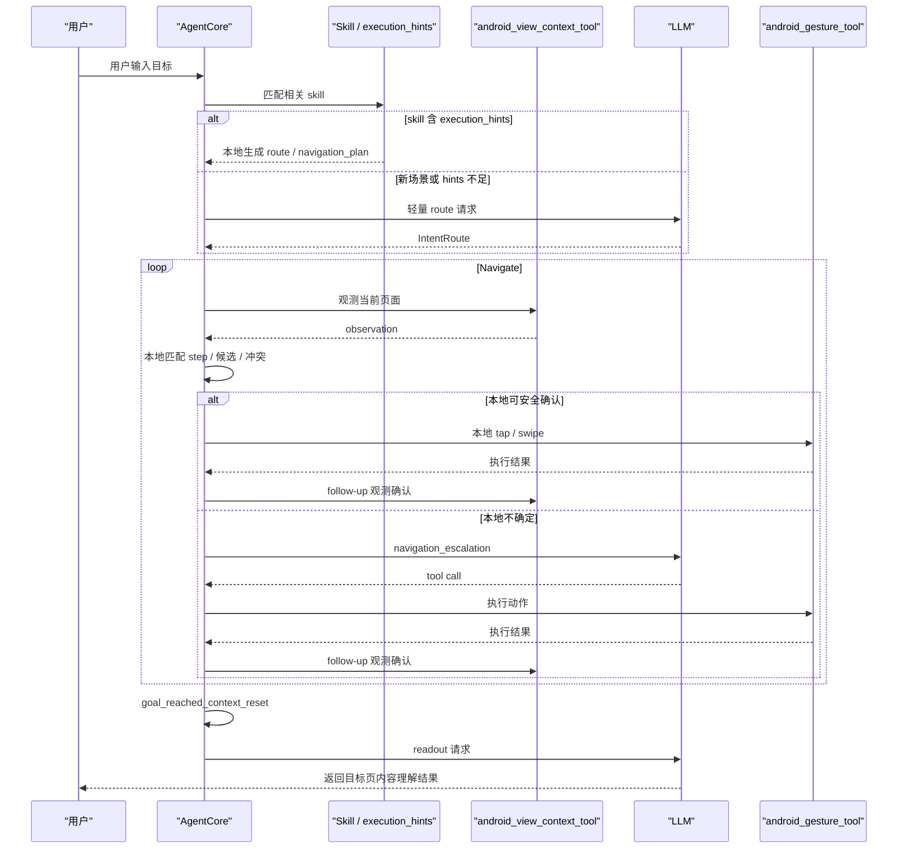

# Agent 执行链路优化说明

本文档记录当前已经在仓库中落地的 Agent 执行链路优化，重点回答 3 个问题：

- 为什么要做这些优化
- 具体落地了哪些优化
- 当前已经拿到了什么收益

如果你想先了解原始链路，再理解这里的优化点，建议先阅读：

- [当前项目业务流程与方案说明](./current-agent-business-flow.md)
- [Prompt 构建与工具展示](./prompt-construction.md)
- [Observation-Bound Execution 协议说明](../protocols/observation-bound-execution.md)

## 背景

在最初的执行链路里，Agent 更接近“每一步都问一次大模型”的模式：

`Observe -> LLM Decide -> Tool -> Re-observe -> LLM Decide`

这种方案能较快打通功能，但在 Android 多步导航场景里会带来 3 个明显问题：

- LLM 轮次多，单轮 `2s~5s` 的耗时会被反复累加
- 请求体会随着 observation、tool result、history 不断膨胀
- 点击后立即观测时，常会拿到旧页面，导致状态确认失败并额外多绕一轮

在 WeLink 这类真实业务页面中，我们从日志里看到的瓶颈很稳定：

- `android_gesture_tool` 常见只需要 `40ms~80ms`
- `android_view_context_tool` 常见只需要 `0.6s~1.3s`
- 真正慢的是多轮 LLM 往返和逐轮增长的上下文

因此，优化目标不是继续微调某一个 prompt，而是把链路改造成：

- 正确性优先
- 本地可确定的步骤尽量本地执行
- 只在必要处让 LLM 参与
- 让 readout 只消费目标页上下文，而不是带着整段导航历史继续总结

## 当前方案的一句话概括

当前已经落地的主方向是“半规则半模型”：

`Route -> Navigate -> Readout`

含义如下：

- `Route`
  优先基于命中的 skill / execution_hints 构造意图路由；新场景或 hints 不足时再升级给 LLM
- `Navigate`
  导航阶段优先走本地状态机、候选过滤和安全快执行
- `Readout`
  到达目标页后重置上下文，只对目标页再发一次 LLM 请求做理解和总结

这不是完全去掉 LLM，而是把 LLM 从“每一步执行器”降级成“冷启动路由器、歧义处理器和内容理解器”。


## 当前主流程图

下面这张图描述的是当前已经落地的主执行路径，而不是理想化的未来方案。



## 典型流程示例：查看云空间页面内容

下面用“查看云空间页面的内容”这条基准指令，说明 `Route -> Navigate -> Readout` 在当前实现里是如何落地的。

### Step 1. Route

用户输入：

```text
查看云空间页面的内容
```

当前实现里，这一步通常不会先额外请求一轮 route LLM，而是先命中 `cloud_space_summary` skill，并直接使用它的 `execution_hints` 构造 route。

可抽象为下面这份中间状态：

```json
{
  "objective": "查看云空间页面的内容",
  "selected_skill": "cloud_space_summary",
  "task_type": "navigate_and_read",
  "navigation_goal": "HWBoxRecentlyUsedActivity",
  "readout_goal": "查看云空间页面的内容",
  "escalation_policy": "on_ambiguity_or_no_progress",
  "stop_condition": {
    "page_predicates": [
      "HWBoxRecentlyUsedActivity"
    ],
    "requires_readout": true
  }
}
```

同时，skill 中的 `execution_hints` 会生成这份导航计划：

```json
{
  "steps": [
    {
      "activity": "MainActivity",
      "target": "左上角个人中心入口",
      "aliases": ["左上角头像", "左上角个人中心", "左上角我的"],
      "region": "top_left",
      "action": "tap"
    },
    {
      "activity": "MeMainActivity",
      "target": "云空间",
      "aliases": ["云空间", "云盘", "云文档"],
      "action": "tap"
    },
    {
      "activity": "HWBoxRecentlyUsedActivity",
      "action": "readout",
      "readout": true
    }
  ]
}
```

需要注意的一点是：

- 用户输入负责命中 skill，并决定这是“导航后还要 readout”的任务
- `MainActivity`、`MeMainActivity`、`HWBoxRecentlyUsedActivity` 这些页面信息，当前主要来自 skill 的 `execution_hints.steps[].activity`

### Step 2. Navigate（本地优先）

导航阶段，系统会优先尝试本地执行，而不是立刻让模型重规划。

#### 2.1 首页 -> 个人中心

当前页：

```text
activity = MainActivity
pending_step = tap 左上角个人中心入口
phase = advance
mode = planned_fast_execute
```

执行逻辑：

- 先做一次 `discovery` observation
- 本地执行候选过滤
- 如果没有稳定文本候选，但 step 明确是左上角/头像类入口，则触发 `fast_execute_region_coordinate_recovery`

当前已落地版本里的代表性结果：

```text
fast_execute_region_coordinate_recovery
action=tap
target=左上角个人中心入口
x=82
y=172
```

也就是说，首页这一步已经能在本地完成，不再需要专门发一轮导航 LLM 请求。

#### 2.2 点击后的确认

首页点击后不会立刻把“第一次观测还停在旧页”当成失败，而是进入待确认状态：

```text
awaiting_confirmation = step 0
retry_delay = 350ms
```

确认流程是：

- follow-up observation
- 如果仍像旧页，则短等一次
- 再做一次 follow-up observation
- 如果页面切到了 `MeMainActivity`，则确认 step 0 成功

这一步的收益是把“页面切换慢半拍”的伪失败吸收掉，避免额外回退到 LLM。

#### 2.3 个人中心 -> 云空间

当 step 0 成功后，下一步的目标已经从“左上角个人中心入口”变成“云空间”。此时系统会主动触发：

```text
navigation_observe_refresh
reason = pending_target_changed
targetHint = 云空间
```

这样做的目的，是确保后续 observation 是围绕“云空间”获取的，而不是继续带着上一步的首页目标提示。

当前页：

```text
activity = MeMainActivity
pending_step = tap 云空间
phase = advance
mode = planned_fast_execute
```

本地会再次尝试 fast execute，但当前已知的边界是：

- 个人中心页上“云空间”会出现 `2` 个匹配候选
- 系统当前会把它视为高风险歧义，而不是贸然点击

典型中间状态如下：

```text
fast_execute_evaluated
target=云空间
primary_matches=2
decision=ambiguous_candidate
```

所以这一步当前会升级到：

```text
navigation_escalation
reason=ambiguous_or_low_confidence
```

也就是说，当前链路还不是“全本地导航”，而是“首页本地 + 个人中心歧义时单次升级”。

### Step 3. Readout

当系统确认已经到达目标页后：

```text
activity = HWBoxRecentlyUsedActivity
phase = readout
goal_reached = true
```

此时会触发：

```text
goal_reached_context_reset
```

重置后保留的内容只有：

- 用户原始目标
- 当前目标页 observation
- selected skill 摘要
- execution state 摘要

主动丢弃的内容包括：

- 首页 observation
- 个人中心 observation
- 旧 gesture 结果
- 旧导航 reasoning
- 导航工具 schema

然后再发最终的 readout 请求：

```text
request_profile = readout
tool_count = 0
body_length ~= 12KB
```

这轮 LLM 的职责不再是导航，而只是理解当前云空间页面的内容，例如：

- 页面标题
- 可见分类
- 最近访问区域
- “上传/新建”等可见操作
- 当前是否显示“暂无内容”

### 当前这个示例的真实链路总结

“查看云空间页面的内容”这条指令，在当前版本里的实际执行方式可以概括为：

1. 用户输入命中 `cloud_space_summary`
2. 基于 `execution_hints` 本地构造 route
3. 首页 observation
4. 本地 fast execute 点击左上角个人中心
5. 通过“短等待 + 一次重试”确认进入个人中心
6. 刷新 targetHint=云空间
7. 个人中心页 observation
8. 由于“云空间”存在 2 个候选，升级 1 次 `navigation_escalation`
9. 点击进入云空间
10. 再通过“短等待 + 一次重试”确认进入目标页
11. 执行 `goal_reached_context_reset`
12. 发 1 次 readout LLM 请求
13. 返回云空间页面内容总结

也就是说，这条用例当前已经从“每一步都问模型”变成了：

`本地 Route -> 本地 Navigate（首页） -> 单次导航升级（个人中心歧义） -> Readout`

## 为什么不继续沿用“每步都问模型”

继续沿用旧链路有两个结构性问题，很难仅靠裁 prompt 彻底解决。

第一，模型承担了太多本地本应确定的职责：

- 选 skill
- 判断当前在哪一步
- 选点击目标
- 决定下一步是不是继续导航
- 判断是不是到达目标页
- 最后再做 readout

第二，哪怕单轮请求体已经裁小，只要还是 5 到 6 轮模型往返，总时延和总 token 成本依然会偏高。

所以当前落地的优化不是单点 patch，而是一组围绕“减少模型参与次数”和“让模型只看必要信息”的系统性改造。

## 已落地优化清单

下表按“为什么做”和“收益”来归纳已经落地的优化。

| 优化项 | 为什么这样做 | 已落地实现 | 直接收益 |
| --- | --- | --- | --- |
| 三段式执行骨架 | 把 LLM 从全流程执行器变成路由器和读内容执行器 | 在 `agent-core` 中引入 `IntentRoute`、`StopConditionSpec`、`NavigationPlan`、`NavigationCheckpoint` 等类型，并在 `AgentLoop` 中落地 `Route -> Navigate -> Readout` | 为后续减少 LLM 轮数打下结构基础 |
| `ExecutionState` 与结构化导航状态 | 避免每轮都从头重规划 | 运行时维护 `goal`、`phase`、`pending_step`、`selected_skills`、`latest_observation_summary`、`latest_action_result` 等紧凑状态 | 第 2 轮以后不再依赖全量历史重新思考 |
| 命中目标页后重置上下文 | 导航历史对 readout 帮助有限，却会显著拉大请求体 | 命中 `goal_reached` 后执行 `goal_reached_context_reset`，仅保留用户目标、当前页 observation、技能摘要和执行状态 | readout 请求体显著下降，最终总结轮更轻 |
| Observation 分档 | 不同阶段需要的信息密度不同 | `android_view_context_tool` 内部支持 `DISCOVERY / FOLLOW_UP / READOUT` 三种 detail mode | 首页不至于裁坏，目标页也不会继续背全量导航信息 |
| 历史 tool result 摘要化 | 老 observation 和 gesture 结果不需要一直全量保留 | 将旧 tool result 结构化摘要，只保留最新 observation 的高价值内容 | 减少请求体逐轮膨胀 |
| 阶段化 request profile | 中间 tool_call 轮不需要和最终长回答一样的 token 预算 | 为 `tool_call`、`readout`、`final_answer` 设置不同 `max_tokens` 和温度 | 中间决策轮更快收敛 |
| payload 日志降噪 + 网络时序采集 | 先把“慢在哪里”测清，再去优化 | 默认关闭全量 payload 分块日志，保留 `request_payload_summary`、`prompt_segment_lengths`、`network_timing_summary`、`first_tool_call_delta_ms` | 能区分网络、首包、下载、工具阶段和 prompt 大小的影响 |
| 安全快执行 `fast_execute` | 对高置信单候选步骤，没必要再问一轮模型 | 增加候选评分、别名匹配、区域约束、冲突过滤、本地 tap 快执行 | 在稳定场景里减少 LLM 轮次 |
| 角落入口安全过滤 | 首页左上角入口容易被头像、列表项、卡片噪声误导 | 对角落入口步骤增加 `tight_corner`、`profile_entry`、中部列表/卡片候选过滤、越界保护 | 拦住误进 `ChatActivity` 这类高风险误点 |
| 点击后确认重试 | 页面已跳转但第一次 follow-up 观测仍可能停在旧页 | 对 `pending_confirmation` 增加一次短等待和一次确认重试 | 去掉了“确认失败 -> 回退 LLM -> 再确认”的额外轮次 |
| pending target 切换后强制新观测 | 下一步目标变了，但缓存 observation 仍是上一步目标，会导致模型或快执行读旧提示 | 当 `pending_step.target` 与最新 `targetHint` 不一致时，触发 `navigation_observe_refresh` | 进入新阶段后会用新的目标提示重新观测，减少旧页面/旧提示污染 |
| 首页/头像类角落入口坐标恢复 | 左上入口可能是无文本 ImageView，actionableNodes 里没有稳定文本候选 | 当步骤明确偏好左上/头像/个人入口，且文本候选为空时，生成保守 top-left 坐标点击，再走正常确认流程 | 已让首页入口从 1 轮 navigation LLM 变成本地坐标点击 |
| Readout 工具剥离 | 最终读内容阶段不需要继续暴露导航工具 | `readout` 请求 `tool_count=0`，只保留用户目标、目标页 observation、skill 摘要、执行状态 | readout 轮不再携带 gesture / view_context schema，请求体稳定在约 `12KB` |

## 关键优化的设计理由

### 1. 为什么要引入 `Route -> Navigate -> Readout`

这是当前最核心的设计变化。

旧链路里，LLM 同时负责路由、导航、停机判断和内容总结，导致一个简单的两步导航也会被拆成很多轮。

引入三段式之后：

- `Route` 只做一次高层理解
- `Navigate` 默认由本地状态机执行
- `Readout` 只在目标页再请求一次模型

这样做的本质收益不是“单轮更快”，而是“整次任务的模型参与次数更少”。

### 2. 为什么 readout 一定要重置上下文

目标页 readout 的任务和前面的导航任务不是一回事。

导航阶段关心的是：

- 我现在在哪一页
- 该点击哪个入口
- 有没有冲突

readout 阶段关心的是：

- 目标页上有哪些内容
- 用户当前最关心的是什么
- 如何组织最终答案

因此，命中目标页后继续带着中间页 observation、gesture 结果和旧 reasoning，会增加请求体，却很少提升最终答案质量。

`goal_reached_context_reset` 的目的，就是把“导航上下文”和“内容理解上下文”主动切开。

### 3. 为什么要做安全快执行，而不是一味放宽规则

快执行的收益很直接：只要某一步本地能稳定收敛，就可以少一次 LLM 往返。

但 Android 首页往往存在很多视觉噪声：

- 头像
- tab
- 列表项
- 卡片按钮
- 同一区域的多个 icon

如果简单“放宽 fast execute 的阻断条件”，会更容易误点。

所以当前实现采取的是“安全放宽”：

- 只在高置信、低冲突、候选唯一时直接执行
- 对角落入口增加更严格的几何和语义过滤
- 过滤掉中部列表/卡片候选
- 一旦不安全，就回退给 LLM

这保证了优化的方向是“减少不必要的模型轮次”，而不是“用误点换速度”。

### 4. 为什么确认重试的收益会这么大

这次优化里，收益最直接的一项其实是“点击后的确认重试”。

原因很简单：

- tap 本身只需要几十毫秒
- 页面切换真正稳定下来需要额外时间
- 如果 follow-up observation 太早执行，很可能仍然看到旧页

旧逻辑里，第一次确认失败就直接：

- 清掉待确认状态
- 回退 discovery
- 重新走一轮模型决策

这会把一个本来已经成功的跳转，错误地当成“导航失败”。

现在的做法是：

- 如果第一次确认失败，但 observation 看起来还停留在旧页
- 就保留 `awaiting_confirmation`
- 短等一次，再补一轮 follow-up observation

这样能直接吃掉一次多余的回退轮次，而且不会影响执行安全。

## 代表性收益

下面的数据来自同一基准任务的代表性成功链路：

- 场景：从 WeLink 首页进入个人中心，再进入云空间页并 readout
- 模型：`qwen3.5-plus`
- 链路：stream 模式

说明：

- 这些数据用于说明优化方向的有效性
- 它们是代表性日志，不是严格的实验室 AB 测试

### 优化前的典型表现

- 总耗时约 `25.76s`
- LLM 轮数约 `6` 轮
- readout 请求体约 `35.4KB`
- 导航阶段经常出现点击后第一次 follow-up 仍停留在旧页，导致确认失败和额外回退

### 半规则半模型基线的代表性表现

- 总耗时约 `16.85s`
- LLM 轮数降到 `3` 轮
- readout 请求体约 `12KB~16KB`
- 两次导航确认都通过“短等待 + 一次重试”成功确认，不再额外回退

### 可以明确归因的收益

#### 1. 总耗时明显下降

从代表性成功链路看，总耗时从约 `25.76s` 降到约 `16.85s`，下降约 `34.6%`。

#### 2. LLM 轮数明显减少

从 `6` 轮降到 `3` 轮，这比继续单纯裁 prompt 更关键，因为它直接减少了模型参与次数。

#### 3. readout 请求体显著收缩

readout 阶段从约 `35.4KB` 收缩到约 `12KB~16KB`，说明“目标页重置上下文”的方向是成立的。

#### 4. 本地执行阶段不再成为瓶颈

从日志看，本地工具的耗时仍然保持在可控区间：

- `android_gesture_tool` 常见 `50ms` 左右
- `android_view_context_tool` 常见 `0.6s~1.3s`

这进一步说明，当前优化的重点确实应该放在“减少模型轮次”和“减少确认失败”，而不是继续盯着手势耗时。

## 为什么说这套方案确实在节省 token

这套方案的 token 节省不是“理论上可能更省”，而是已经在日志中体现出来了。

当前节省主要来自 4 个方面：

- 命中目标页后重置上下文，readout 不再携带整段导航历史
- 老 tool result 摘要化，不再重复带大量旧 observation
- `tool_call` 和 `readout` 使用不同的请求 profile
- phase-aware tool exposure，让不同阶段只暴露必要工具

但需要强调一点：

这套优化真正高价值的部分，不是把某一轮 prompt 从 40KB 裁到 30KB，而是：

- 在保证正确性的前提下减少整次任务的 LLM 轮数
- 让 readout 只消费目标页信息

也就是说，它节省的不只是“单轮 token”，更是在压“整次任务的总 token”。

## 请求体字段裁剪矩阵

字段级请求体裁剪策略已拆分为独立文档：[请求体字段裁剪清单](./request-payload-field-trimming.md)。

该文档详细列举了 Native / Web 场景的顶层字段、`screenVisionCompact`、`hybridObservation` 中每个字段的含义、是否删除，以及删除后对 LLM 导航、点击和 readout 的影响。这里仅保留核心原则：裁剪只影响发送给 LLM 的 tool result，不删除本地 snapshot；Native / Hybrid 场景默认以 `hybridObservation` 为主，Web / H5 场景在完成等价替代前必须保留 `screenElements.ref/selector`。

## 2026-04-09 最新量化复盘

本节记录本轮在 WeLink 云空间基准场景里已经量化到的阶段性收益。云空间只是验证用例，优化目标仍是通用的 Android 多步导航 + readout 链路。

### 指标演进

| 阶段 | 端到端耗时 | LLM 轮数 | 典型导航请求体 | Readout 请求体 | 关键变化 |
| --- | ---: | ---: | ---: | ---: | --- |
| 早期逐步重规划链路 | 常见 `25s+`，异常/重试链路更长 | 约 `6~7` 轮 | 后续轮曾膨胀到 `70KB~106KB` | 未独立收口 | 每步都让模型重规划，旧 observation / tool result 持续累积 |
| 第一版目标页重置后 | `25.76s` | `6` 轮 | 仍可能 `50KB+` | 约 `35.4KB` | 开始在目标页重建 readout 上下文，但导航仍多轮 |
| 半规则半模型基线 | `16.85s` 左右 | `3` 轮 | 约 `26KB~34KB` | 约 `12KB~16KB` | 本地状态机、确认重试、readout 工具剥离、上下文重置生效 |
| 当前最新实测 | `14.58s` | `2` 轮 | `25.2KB`，且只剩 1 次导航升级 | `12.06KB` | 首页入口已本地 fast execute；剩余瓶颈是一个文本入口歧义升级和最终 readout |

### 具体收益归因

1. **LLM 轮数下降**

   旧链路会把“观察、点击、确认、下一步、读内容”都拆给模型，成功链路也可能走到 `6` 轮左右；当前最新实测是 `2` 轮，其中 `1` 轮是导航歧义升级，`1` 轮是 readout。首页入口已经通过 `fast_execute_region_coordinate_recovery` 在本地完成。

2. **请求体不再逐轮膨胀**

   早期后续轮请求体会从首轮约 `24KB` 膨胀到 `70KB~106KB`。当前 readout 轮稳定在约 `12.06KB`，导航升级轮约 `25.2KB`。也就是说，优化后的收益不是“把某一个 JSON 字段裁短”，而是通过目标页重置、tool result 摘要、readout 不带工具、减少导航 LLM 轮数，降低整次任务总输入。

3. **首页入口已从模型决策变成本地执行**

   之前首页入口没有文本候选时，会回退一次 `navigation_escalation`，单轮常见 `3s` 左右。当前命中 `fast_execute_region_coordinate_recovery`，首页点击本身约 `36ms`，不再产生首页导航 LLM 请求。

4. **目标页 readout 已独立收口**

   目标页确认后触发 `goal_reached_context_reset`，readout 请求 `tool_count=0`，不携带 gesture / view_context schema，不携带旧首页和个人中心的完整 observation。最新 readout 轮请求体约 `12.06KB`，网络 + 生成耗时约 `4.41s`。

5. **点击后的“伪失败”被短等待 + 重试吸收**

   首页和目标页跳转后都可能第一次观测仍在旧页面。当前会保留待确认状态，短等约 `350ms` 再观测一次。这样避免把“页面还没切稳”误判成“点击失败”，从而减少不必要的重新规划。

### 当前剩余的主要性能账单

最新 `14.58s` 成功链路大致拆分如下：

| 阶段 | 耗时 |
| --- | ---: |
| 首页 discovery observation | `1.335s` |
| 首页本地点击 | `0.036s` |
| 首页点击后确认，包括一次短等待 | 约 `2.48s` |
| 个人页刷新 targetHint=云空间 | `0.796s` |
| 云空间入口 navigation_escalation | `3.417s` |
| 云空间点击 | `0.052s` |
| 目标页确认，包括一次短等待 | 约 `2.00s` |
| readout LLM | `4.409s` |

下一步最有价值的优化点是：把“个人页上的文本入口存在 2 个匹配候选”做成安全的本地去重/父子合并。如果这一步命中，已知 skill 的 happy path 可以进一步接近 `0` 轮导航 LLM + `1` 轮 readout LLM。

## 当前边界

虽然收益已经很明显，但当前方案还不是终点。

已知边界包括：

- 首页/头像类入口已具备坐标恢复能力，但仍依赖后续 observation 确认，不把坐标点击视为天然成功
- 个人中心页这类文本入口仍可能出现父/子/文本节点重复候选；当前会安全回退到 `navigation_escalation`
- 不同页面的 `execution_hints` 完整度会影响本地导航命中率
- 当前收益主要集中在导航与 readout 链路，不包含宿主冷启动优化
- 多模态截图能力仍更适合作为冷启动兜底，不适合作为主执行路径

## 结论

当前已经落地的优化，证明了一件很关键的事情：

对于 Android Agent 来说，真正有效的优化方向不是“继续把所有决策都交给大模型”，而是：

- 用一次路由换掉多次重规划
- 用本地状态机和安全快执行换掉不必要的模型轮次
- 用目标页上下文重置换掉无意义的历史负担
- 用确认重试换掉由页面切换时序带来的伪失败

这也是当前链路从“功能可用原型”走向“可持续优化的执行架构”的关键一步。
