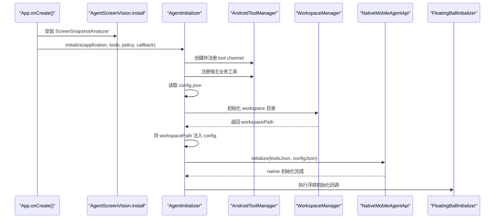
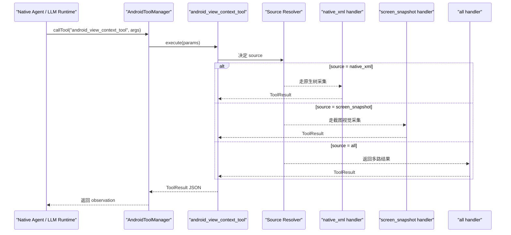
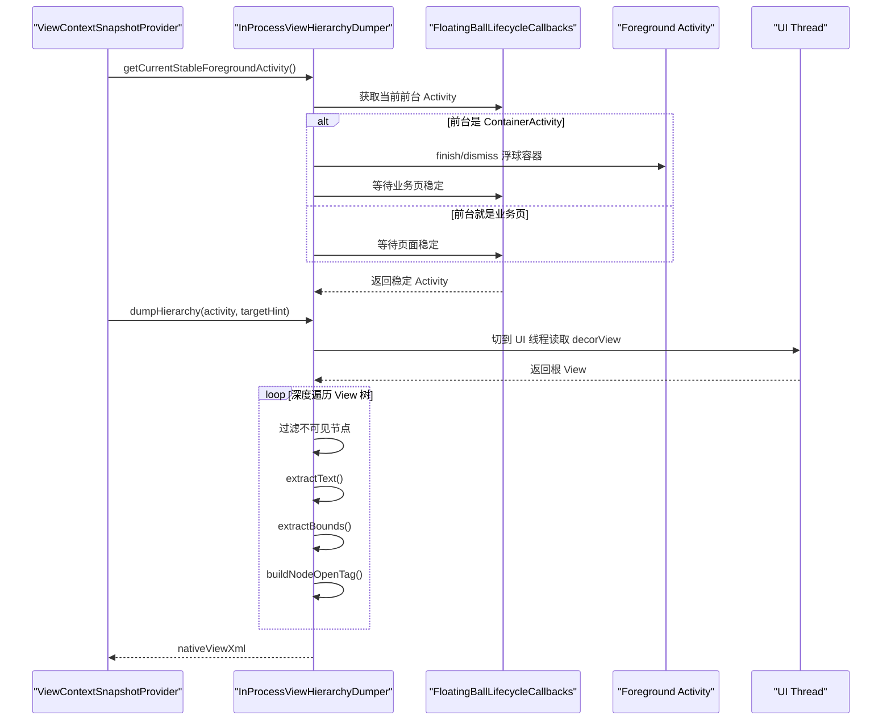
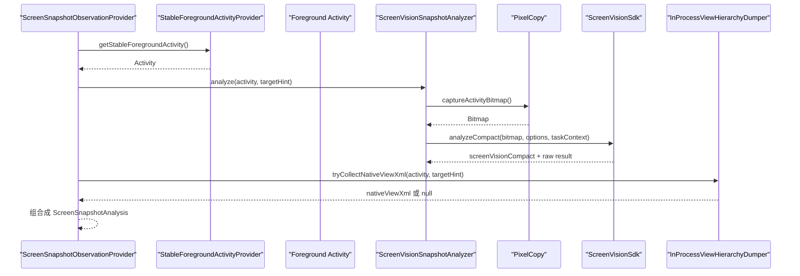
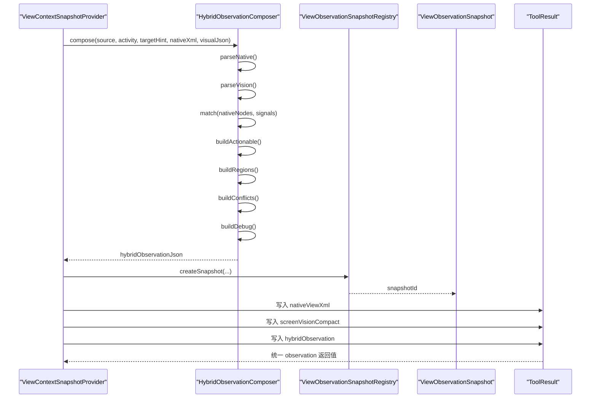
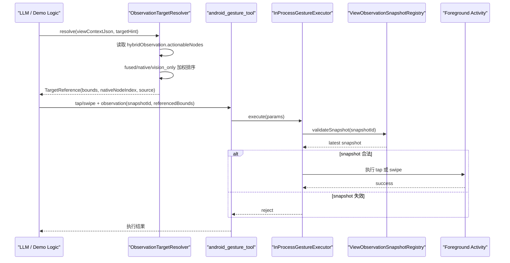
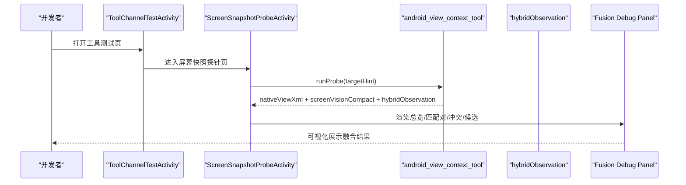

# 当前项目业务流程时序图版

本文档是《[当前项目业务流程与方案说明](./current-agent-business-flow.md)》的配套版本，重点用时序图和分段说明来解释系统运行路径。

如果你想先建立整体认知，建议先读：

- [当前项目业务流程与方案说明](./current-agent-business-flow.md)
- [HybridObservation 字段详解](./hybrid-observation-reference.md)

## 阅读建议

可以按下面顺序阅读：

1. 启动初始化时序
2. 页面观测请求时序
3. `native_xml` 采集时序
4. `screen_snapshot` 采集时序
5. `hybridObservation` 融合与快照时序
6. 目标解析与 gesture 执行时序
7. Demo 调试链路时序

## 1. 启动初始化时序

这一阶段的目标是：把宿主 App 初始化成一个“可被 native Agent 调用 Android tool 的运行环境”。

### 关键代码

- [App.java](../../app/src/main/java/com/hh/agent/app/App.java)
- [AgentScreenVision.java](../../agent-screen-vision/src/main/java/com/hh/agent/screenvision/AgentScreenVision.java)
- [AgentInitializer.java](../../agent-android/src/main/java/com/hh/agent/android/AgentInitializer.java)
- [AndroidToolManager.java](../../agent-android/src/main/java/com/hh/agent/android/AndroidToolManager.java)

### 业务意义

这一阶段不是普通 Android 应用初始化，而是在做三件更关键的事：

- 给 native Agent 准备可调用的 tool 列表
- 给 native runtime 准备配置和 workspace 环境
- 提前把视觉分析能力和浮球能力挂上去

## 2. 页面观测请求总时序

这一阶段的目标是：当大模型需要“看当前页面”时，统一通过 `android_view_context_tool` 发起请求，而不是直接调用底层采集器。

### 关键代码

- [ViewContextToolChannel.java](../../agent-android/src/main/java/com/hh/agent/android/channel/ViewContextToolChannel.java)
- [AllViewContextSourceHandler.java](../../agent-android/src/main/java/com/hh/agent/android/channel/AllViewContextSourceHandler.java)

### 业务意义

这一步把“页面观测”收敛成一个顶层工具。好处是：

- 模型侧不用感知 Android 内部实现差异
- 底层可以继续替换 source，而不需要改 prompt 入口
- 后续可以继续加入新的观测源，而不破坏整体调用习惯

## 3. `native_xml` 采集时序

这一阶段的目标是：从当前稳定前台 Activity 抓出紧凑的原生 View 树快照。

### 关键代码

- [InProcessViewHierarchyDumper.java](../../agent-android/src/main/java/com/hh/agent/android/viewcontext/InProcessViewHierarchyDumper.java)

### 业务意义

这条链路提供的是“结构真值层”：

- 原生节点更适合做点击锚点
- `bounds`、`resource-id`、`text` 更适合做稳定动作引用
- 对 gesture 执行层最重要

它并不擅长视觉语义，因此只是 hybrid 的一半输入。

## 4. `screen_snapshot` 采集时序

这一阶段的目标是：从当前页面抓截图，并通过本地视觉 SDK 生成 compact 页面理解结果。

### 关键代码

- [ScreenSnapshotObservationProvider.java](../../agent-android/src/main/java/com/hh/agent/android/viewcontext/ScreenSnapshotObservationProvider.java)
- [ScreenVisionSnapshotAnalyzer.java](../../agent-screen-vision/src/main/java/com/hh/agent/screenvision/ScreenVisionSnapshotAnalyzer.java)

### 业务意义

这里有一个非常关键的实现细节：

即使当前 source 是 `screen_snapshot`，系统也会尽量再补采一次 `nativeViewXml`。这意味着 screenshot 路径并不是纯视觉孤岛，而是尽量把自己也拉回 hybrid 主链路。

## 5. 融合与快照注册时序

这一阶段的目标是：把原生树和视觉结果融合成单一 observation，并生成 `snapshotId`。

### 关键代码

- [ViewContextSnapshotProvider.java](../../agent-android/src/main/java/com/hh/agent/android/viewcontext/ViewContextSnapshotProvider.java)
- [HybridObservationComposer.java](../../agent-android/src/main/java/com/hh/agent/android/viewcontext/HybridObservationComposer.java)
- [ViewObservationSnapshotRegistry.java](../../agent-android/src/main/java/com/hh/agent/android/viewcontext/ViewObservationSnapshotRegistry.java)
- [ViewObservationSnapshot.java](../../agent-android/src/main/java/com/hh/agent/android/viewcontext/ViewObservationSnapshot.java)

### 业务意义

这一步是当前系统真正的核心：

- 它把多路观测变成一个统一输入
- 它把当前页面状态沉淀成一个可校验的快照
- 它让后续 gesture 能做到 observation-bound

## 6. 目标选择与手势执行时序

这一阶段的目标是：让模型或业务代码优先基于 `hybridObservation.actionableNodes` 选目标，再以 observation 绑定方式执行动作。

### 关键代码

- [ObservationTargetResolver.java](../../app/src/main/java/com/hh/agent/viewcontext/ObservationTargetResolver.java)
- [InProcessGestureExecutor.java](../../agent-android/src/main/java/com/hh/agent/android/gesture/InProcessGestureExecutor.java)

### 业务意义

这个设计保证了：

- 模型优先消费融合结果，而不是直接啃原始 XML
- gesture 不会直接猜点击位置
- 任何动作都必须绑定当前 observation 上下文

## 7. Demo 调试链路时序

这一阶段的目标是：让开发者能看到融合过程本身，而不是只看到最终点击结果。

### 关键代码

- [ScreenSnapshotProbeActivity.java](../../app/src/main/java/com/hh/agent/ScreenSnapshotProbeActivity.java)
- [MockChatProbeRunner.java](../../app/src/main/java/com/hh/agent/mockim/debug/MockChatProbeRunner.java)

### 业务意义

调试页不是附属功能，而是当前方案的重要组成部分。它让你能直接看到：

- 原生节点和视觉结果是怎么配上的
- 哪些节点只存在于原生树
- 哪些候选只存在于视觉结果
- 冲突为什么出现
- 最终目标为什么偏向 `fused`、`native` 或 fallback

## 时序图版总结

如果只记一条主线，可以记成：

`App 初始化 Agent 环境 -> LLM 调 android_view_context_tool -> 原生树和视觉结果分别采集 -> HybridObservationComposer 融合并生成 snapshotId -> ObservationTargetResolver 选目标 -> android_gesture_tool 校验 observation 后执行动作`

其中最重要的设计点是两条：

- 所有页面理解最终都会被收敛成 `hybridObservation`
- 所有页面动作最终都必须绑定 `snapshotId`

这也是当前项目“可解释、可执行、可调试”的核心原因。
