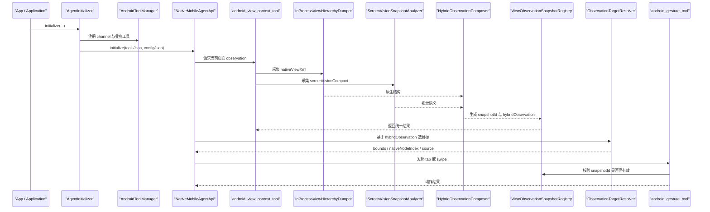

# 当前项目业务流程与方案说明

本文档面向需要快速理解当前工程运行方式的开发者，重点说明：

- 当前项目的端到端业务闭环是什么
- 启动阶段、观测阶段、融合阶段、执行阶段分别由哪些模块负责
- `InProcessViewHierarchyDumper`、`agent-screen-vision`、`hybridObservation` 之间如何协作
- 大模型最终消费的页面信息是什么，以及动作是如何安全落地的

如果你更关心单个协议或单个模块的扩展方式，可以继续阅读：

- [Android Tool 架构说明](./android-tool-architecture.md)
- [Prompt 构建与工具展示](./prompt-construction.md)
- [Observation-Bound Execution 协议说明](../protocols/observation-bound-execution.md)

配套文档：

- [当前项目业务流程时序图版](./current-agent-business-flow-sequence.md)
- [HybridObservation 字段详解](./hybrid-observation-reference.md)

## 一句话概览

当前项目的核心业务流可以概括为：

`应用启动 -> 初始化 Android/Native Agent 运行环境 -> 大模型通过 tool 请求页面观测 -> 系统同时采集原生 View 树与本地视觉理解 -> 融合成 hybridObservation -> 模型优先从 actionableNodes 中选目标 -> gesture 侧用 snapshotId 校验后执行动作 -> 页面变化后再次观测`

这是一条典型的 Agent 闭环：

- Observe
- Understand
- Decide
- Act
- Re-observe

## 系统角色分工

当前工程可以粗分成 4 个层次：

| 层次 | 主要模块 | 主要职责 |
| --- | --- | --- |
| 宿主层 | `app` | 提供 `Application`、业务工具、测试页、探针页 |
| Android Agent 层 | `agent-android` | 工具通道、页面观测、手势执行、生命周期管理、与 native 桥接 |
| Native Agent 层 | `agent-core` | native 侧 Agent 运行时、工具调度、底层推理框架 |
| 本地视觉层 | `agent-screen-vision` | 截图、OCR、UI 分类、compact 页面理解 |

其中最关键的职责边界是：

- `agent-android` 负责把 Android 能力包装成 tool
- `agent-core` 负责把这些 tool 暴露给大模型并调度调用
- `agent-screen-vision` 负责提供视觉语义补充
- `app` 负责把业务能力和 demo 页面接入整条链路

## 端到端业务时序

## 第一阶段：应用启动与 Agent 初始化

### 1. `App.onCreate()`

入口位于：

- [app/src/main/java/com/hh/agent/app/App.java](../../app/src/main/java/com/hh/agent/app/App.java)

`App.onCreate()` 的主要职责不是普通业务初始化，而是把当前宿主应用改造成一个“可被大模型驱动的 Android 执行环境”。

它主要做三件事：

1. 安装本地视觉分析器  
   调用 `AgentScreenVision.install(this)`，把 `ScreenVisionSnapshotAnalyzer` 注入到 `agent-android`。

2. 组装业务工具  
   把通知、剪贴板、联系人搜索、IM 发消息等业务能力注册成 tool。

3. 初始化整个 Agent 运行时  
   调用 `AgentInitializer.initialize(...)`，把工具、策略、语音识别器、浮球初始化回调统一接入。

### 2. `AgentInitializer.initialize(...)`

入口位于：

- [agent-android/src/main/java/com/hh/agent/android/AgentInitializer.java](../../agent-android/src/main/java/com/hh/agent/android/AgentInitializer.java)

这是 Java 侧 Agent 运行环境的真正总入口。它按顺序完成以下工作：

1. 初始化 transcript store、logger、策略依赖
2. 创建 `AndroidToolManager`
3. 注册 Android 顶层 tool channel 和宿主业务工具
4. 初始化 callback bridge，使 native 能回调 Java tool
5. 读取 `assets/config.json`
6. 初始化 workspace 目录
7. 将 `workspacePath` 注入 config JSON
8. 加载 native 库 `icraw`
9. 调用 `NativeMobileAgentApi.initialize(toolsJson, configJson)`
10. 最后执行浮球等 UI 初始化回调

这里有两个值得注意的实现细节：

- 当 `config.json` 不存在时，会回退到空 JSON，而不是空字符串，避免 native 初始化失败
- `workspacePath` 会被稳定写入 config，供 native runtime 和 workspace prompt 使用

### 3. `AndroidToolManager`

入口位于：

- [agent-android/src/main/java/com/hh/agent/android/AndroidToolManager.java](../../agent-android/src/main/java/com/hh/agent/android/AndroidToolManager.java)

它是 Java 侧的工具总线，负责两件事：

1. 生成给 native 的 `tools.json`
2. 在 native 触发 tool call 时，把调用路由回正确的 Java channel

当前它默认注册 3 个核心 channel：

- `call_android_tool`
- `android_gesture_tool`
- `android_view_context_tool`

因此，从业务层面看，所有 Android 能力最终都被抽象成“工具”，而不是散落在页面代码里的直接调用。

## 第二阶段：页面观测入口

### 1. `android_view_context_tool`

入口位于：

- [agent-android/src/main/java/com/hh/agent/android/channel/ViewContextToolChannel.java](../../agent-android/src/main/java/com/hh/agent/android/channel/ViewContextToolChannel.java)

它是当前整个“看页面”链路的统一入口。大模型或上层 runtime 并不直接调用原生树采集器或视觉模块，而是统一调用这个 tool。

当前支持的 source 有：

- `native_xml`
- `web_dom`
- `screen_snapshot`
- `all`

当前 prompt 和工具描述已经约定：

1. 优先读取 `hybridObservation.summary`
2. 再读取 `hybridObservation.actionableNodes`
3. 然后读取 `hybridObservation.conflicts`
4. `nativeViewXml`、`screenVisionCompact`、`webDom` 只作为原始 fallback 证据

也就是说，系统当前已经是 hybrid-first，而不是 raw-data-first。

### 2. source 选择

在真正执行前，`ViewContextToolChannel` 会先根据运行时策略决定当前应使用哪种 source。

这一步通常由以下几类信息共同决定：

- 宿主 App 注入的 Activity 级别策略
- 当前页面是否更像原生页、WebView 页或视觉优先页
- 是否需要返回多路结果一起调试

source 选择完成后，才会进入具体 handler。

## 第三阶段：原生结构观测

### 1. `InProcessViewHierarchyDumper`

入口位于：

- [agent-android/src/main/java/com/hh/agent/android/viewcontext/InProcessViewHierarchyDumper.java](../../agent-android/src/main/java/com/hh/agent/android/viewcontext/InProcessViewHierarchyDumper.java)

它的职责是：在宿主进程内部抓取当前前台稳定 Activity 的 View 树，并把它转成紧凑 XML。

执行流程如下：

1. 获取当前稳定前台 Activity
2. 如果当前前台其实是浮球容器页，则先处理浮球容器，再等待真实业务页稳定
3. 切到 UI 线程读取 `decorView`
4. 从根节点开始递归遍历 View 树
5. 过滤不可见、宽高为 0、alpha 为 0 或已脱离树的节点
6. 提取高价值字段，拼成 `nativeViewXml`

当前它保留的主要信息包括：

- class
- resource-id
- text
- bounds
- index

并且设置了节点上限，避免把整棵大树原封不动交给模型。

### 2. 这条链路的业务定位

`InProcessViewHierarchyDumper` 并不是通用 Accessibility 方案，而是当前宿主内页面的“结构真值层”。

它最擅长的事情是：

- 获取真实控件坐标
- 获取原生文本和资源 ID
- 帮助 gesture 层做稳定点击
- 为模型提供结构化页面证据

它不擅长的事情是：

- 纯图标语义
- 自绘控件的视觉分区
- 图像型卡片理解
- 视觉布局层级推断

这正是本地视觉模块要补位的地方。

## 第四阶段：本地视觉观测

### 1. `ScreenVisionSnapshotAnalyzer`

入口位于：

- [agent-screen-vision/src/main/java/com/hh/agent/screenvision/ScreenVisionSnapshotAnalyzer.java](../../agent-screen-vision/src/main/java/com/hh/agent/screenvision/ScreenVisionSnapshotAnalyzer.java)

它的职责是：

1. 截取当前 Activity 窗口位图
2. 将图片交给本地视觉 SDK 做 compact 分析
3. 返回适合大模型消费的视觉摘要结果

当前截图使用 `PixelCopy`，而不是简单 `decorView.draw()`。这样做的原因是：

- 更接近真实屏幕显示结果
- 对硬件加速内容更稳
- 对复杂页面和 WebView 更友好

### 2. `ScreenVisionSdk.analyzeCompact(...)`

分析时会将 `targetHint` 包装成 `TaskContext`，让视觉模块带着任务意识做 compact 裁剪。

输出结果通常包括：

- 页面 summary
- OCR texts
- controls
- sections
- list items
- 各类 bbox

这条链路的定位是“视觉语义层”。它不是最终动作真值，而是帮助系统理解：

- 页面在表达什么
- 哪些区域像卡片、按钮、搜索框
- 哪些文本在视觉上是显著的
- 哪些控件可能在原生树里不够明显

## 第五阶段：统一融合为 `hybridObservation`

### 1. 融合入口

入口位于：

- [agent-android/src/main/java/com/hh/agent/android/viewcontext/ViewContextSnapshotProvider.java](../../agent-android/src/main/java/com/hh/agent/android/viewcontext/ViewContextSnapshotProvider.java)
- [agent-android/src/main/java/com/hh/agent/android/viewcontext/ScreenSnapshotObservationProvider.java](../../agent-android/src/main/java/com/hh/agent/android/viewcontext/ScreenSnapshotObservationProvider.java)

这两处 provider 会在采集完结果后调用 `HybridObservationComposer.compose(...)`，把原生结构和视觉语义统一合成一份 observation。

### 2. `HybridObservationComposer`

入口位于：

- [agent-android/src/main/java/com/hh/agent/android/viewcontext/HybridObservationComposer.java](../../agent-android/src/main/java/com/hh/agent/android/viewcontext/HybridObservationComposer.java)

它不是简单拼接两份 JSON，而是做了真正的融合：

1. 解析 `nativeViewXml`
2. 解析 `screenVisionCompact`
3. 基于 `bbox` 重叠和文本相似度做 cross-link
4. 结合 `targetHint` 对候选目标加权
5. 生成统一的 `hybridObservation`

### 3. 输出结构

`hybridObservation` 当前的核心字段包括：

- `mode`
  当前是 `native_only`、`screen_only` 还是 `hybrid_native_screen`
- `summary`
  页面级摘要
- `executionHint`
  给模型的动作决策提示
- `quality`
  质量统计，如原生节点数、视觉控件数、融合成功数、裁剪丢弃数
- `actionableNodes`
  最终给模型优先消费的可执行候选池
- `sections`
  视觉分区及其原生锚点
- `listItems`
  视觉列表项及其原生锚点
- `conflicts`
  两路结果不一致的地方
- `debug`
  调试面板用的解释数据

### 4. `actionableNodes` 的业务意义

`actionableNodes` 是当前整个链路里最重要的输出。它不是原生节点列表，也不是 OCR 框列表，而是“已经过融合和排序的动作候选池”。

其中每个节点大致可以分成三类来源：

- `fused`
  原生节点和视觉信号成功配对，可信度最高
- `native`
  只有原生树命中，没有视觉配对
- `vision_only`
  只有视觉命中，没有原生锚点，可信度较低

这意味着系统已经不再让模型自己去完成所有底层对齐，而是提前把“最值得点击的目标集合”整理出来。

### 5. `conflicts` 的业务意义

`conflicts` 用来显式表达不确定性，例如：

- 高价值视觉候选没有 native match
- 高价值 native 节点没有视觉 match
- 视觉 compaction 丢弃过多信号

有了这层信息，模型和上层 runtime 可以知道：

- 哪些候选值得保守处理
- 哪些结果需要 fallback
- 哪些页面当前更依赖原生结构

### 6. `debug` 的业务意义

`debug` 主要用于调试面板和质量分析，当前包含：

- `matchPairs`
- `nativeOnlyCandidates`
- `visionOnlyCandidates`

这三类中间结果非常适合用来分析“为什么某个页面融合效果不好”。

## 第六阶段：快照注册与 observation 绑定

### 1. 快照注册

入口位于：

- [agent-android/src/main/java/com/hh/agent/android/viewcontext/ViewObservationSnapshotRegistry.java](../../agent-android/src/main/java/com/hh/agent/android/viewcontext/ViewObservationSnapshotRegistry.java)
- [agent-android/src/main/java/com/hh/agent/android/viewcontext/ViewObservationSnapshot.java](../../agent-android/src/main/java/com/hh/agent/android/viewcontext/ViewObservationSnapshot.java)

每完成一次 observation，系统都会创建一个 snapshot，并生成唯一 `snapshotId`。

当前 snapshot 中已保存的核心信息包括：

- `snapshotId`
- `activityClassName`
- `source`
- `targetHint`
- `nativeViewXml`
- `screenVisionCompact`
- `screenSnapshotRef`
- `hybridObservationJson`

### 2. 为什么必须有 `snapshotId`

因为页面是动态变化的。没有 `snapshotId`，系统很容易发生这种错误：

1. 模型看的是旧页面
2. 用户或系统让页面发生了变化
3. 手势执行器却还在按旧 observation 点击

`snapshotId` 的作用就是把“看见的页面”和“准备执行的动作”绑定成同一轮上下文。

## 第七阶段：模型消费与目标解析

### 1. prompt 侧当前推荐顺序

当前 prompt 和工具定义已经统一成 hybrid-first 的消费顺序：

1. 先看 `hybridObservation.summary`
2. 再看 `hybridObservation.actionableNodes`
3. 再看 `hybridObservation.conflicts`
4. 最后才回退到 `nativeViewXml` 或 `screenVisionCompact`

因此，当前系统并不是要求模型直接读底层原始数据，而是要求模型优先消费“已经面向动作决策整理好的结果”。

### 2. `ObservationTargetResolver`

入口位于：

- [app/src/main/java/com/hh/agent/viewcontext/ObservationTargetResolver.java](../../app/src/main/java/com/hh/agent/viewcontext/ObservationTargetResolver.java)

它会优先从 `hybridObservation.actionableNodes` 中挑选目标，并按来源做加权：

- `fused` 优先级最高
- `native` 次之
- `vision_only` 最弱

如果融合结果仍不能稳定选出目标，它才会回退到 `nativeViewXml`。

这意味着当前系统的目标选择逻辑已经明确表达了一个设计原则：

- 视觉结果可以帮助提升理解和排序
- 但真正稳妥的执行仍然优先依赖带原生锚点的候选

## 第八阶段：手势执行

### 1. `android_gesture_tool`

执行入口位于：

- [agent-android/src/main/java/com/hh/agent/android/gesture/InProcessGestureExecutor.java](../../agent-android/src/main/java/com/hh/agent/android/gesture/InProcessGestureExecutor.java)

当前它已经支持真实 in-process 执行，不再只是 mock 通道。

### 2. 执行前校验

在真正 tap 或 swipe 前，它会先校验 observation：

1. 是否携带 `snapshotId`
2. `snapshotId` 是否等于当前最新 snapshot
3. 当前前台 Activity 是否仍与该 observation 对应

只有通过这些校验，动作才会真正发出。

### 3. `referencedBounds`

当前 gesture 执行也依赖 observation 提供的 `referencedBounds`：

- tap 时可作为目标元素 bounds
- swipe 时必须明确告诉系统要滚动哪个容器

这保证了 gesture 不是在“盲点坐标”，而是在“点击当前 observation 中已经定位过的页面元素”。

## 第九阶段：Demo 与调试链路

### 1. `ToolChannelTestActivity`

这是当前 demo 的主要入口页，用来拉起不同的工具调试页面。

### 2. `ScreenSnapshotProbeActivity`

入口位于：

- [app/src/main/java/com/hh/agent/ScreenSnapshotProbeActivity.java](../../app/src/main/java/com/hh/agent/ScreenSnapshotProbeActivity.java)

这个页面不是普通业务页，而是“融合观测调试面板”。

它会在页面启动后主动调用一次 `android_view_context_tool`，然后把结果拆成多个调试卡片展示，包括：

- 融合快照总览
- 目标选择偏向
- 融合配对
- 可执行节点
- 仅原生候选
- 仅视觉候选
- 视觉分区
- 视觉列表项
- 冲突提示
- 原始信号摘要

它的价值在于：把原本黑箱的融合流程显式展开，方便开发者判断：

- 两路结果是如何相互影响的
- 为什么某个节点是 `fused`
- 为什么某个候选被保留成 `vision_only`
- 为什么当前页面会出现冲突

### 3. 其他示例链路

当前 demo 中还有两条很适合顺着读的链路：

- [app/src/main/java/com/hh/agent/mockim/ChatListFragment.java](../../app/src/main/java/com/hh/agent/mockim/ChatListFragment.java)
  展示了如何先拿 observation，再选目标，再调 gesture
- [app/src/main/java/com/hh/agent/mockim/debug/MockChatProbeRunner.java](../../app/src/main/java/com/hh/agent/mockim/debug/MockChatProbeRunner.java)
  展示了如何把 hybrid 结果和最终目标解析结果打印出来

## 当前方案的核心设计思想

### 1. 工具化

不是让 native 直接依赖 Java 页面实现，而是通过 tool channel 统一暴露能力。

### 2. 观察与执行解耦

`android_view_context_tool` 负责看，`android_gesture_tool` 负责做，中间通过 snapshot 绑定。

### 3. 原生结构与视觉语义分层

- `InProcessViewHierarchyDumper` 提供结构真值
- `agent-screen-vision` 提供视觉语义

### 4. 融合优先

模型默认先读 `hybridObservation`，而不是原始 `nativeViewXml` 或原始 OCR 结果。

### 5. 执行安全

所有动作都必须带 observation，并在执行前校验 `snapshotId`。

## 当前方案的优势与边界

### 优势

- 相比纯截图，`nativeViewXml` 更省 token、更利于结构化推理
- 相比纯原生树，视觉模块能补充图像语义与页面区域理解
- hybrid 输出更贴近动作决策，而不是要求模型自己做底层对齐
- observation-bound execution 能显著降低误点风险

### 边界

- 当前视觉模块仍可能存在组件识别不准、分块异常
- `vision_only` 候选仍然缺少和原生控件一样稳定的执行锚点
- 当前方案仍以宿主进程内页面为主，不是跨 App 的通用 Accessibility 方案
- 对强视觉型页面，后续仍需要持续优化 hybrid 策略与 fallback 策略

## 推荐阅读顺序

如果你要继续深入代码，推荐按下面顺序阅读：

1. [app/src/main/java/com/hh/agent/app/App.java](../../app/src/main/java/com/hh/agent/app/App.java)
2. [agent-android/src/main/java/com/hh/agent/android/AgentInitializer.java](../../agent-android/src/main/java/com/hh/agent/android/AgentInitializer.java)
3. [agent-android/src/main/java/com/hh/agent/android/AndroidToolManager.java](../../agent-android/src/main/java/com/hh/agent/android/AndroidToolManager.java)
4. [agent-android/src/main/java/com/hh/agent/android/channel/ViewContextToolChannel.java](../../agent-android/src/main/java/com/hh/agent/android/channel/ViewContextToolChannel.java)
5. [agent-android/src/main/java/com/hh/agent/android/viewcontext/InProcessViewHierarchyDumper.java](../../agent-android/src/main/java/com/hh/agent/android/viewcontext/InProcessViewHierarchyDumper.java)
6. [agent-screen-vision/src/main/java/com/hh/agent/screenvision/ScreenVisionSnapshotAnalyzer.java](../../agent-screen-vision/src/main/java/com/hh/agent/screenvision/ScreenVisionSnapshotAnalyzer.java)
7. [agent-android/src/main/java/com/hh/agent/android/viewcontext/HybridObservationComposer.java](../../agent-android/src/main/java/com/hh/agent/android/viewcontext/HybridObservationComposer.java)
8. [app/src/main/java/com/hh/agent/viewcontext/ObservationTargetResolver.java](../../app/src/main/java/com/hh/agent/viewcontext/ObservationTargetResolver.java)
9. [agent-android/src/main/java/com/hh/agent/android/gesture/InProcessGestureExecutor.java](../../agent-android/src/main/java/com/hh/agent/android/gesture/InProcessGestureExecutor.java)
10. [app/src/main/java/com/hh/agent/ScreenSnapshotProbeActivity.java](../../app/src/main/java/com/hh/agent/ScreenSnapshotProbeActivity.java)

## 总结

当前项目已经从“单一路径的页面理解”演进成“原生结构 + 本地视觉 + 融合决策 + observation 绑定执行”的完整 Agent 闭环。

从工程角度看，它最重要的价值不只是“能看见页面”，而是：

- 能把页面理解结果整理成适合模型消费的统一 observation
- 能把页面理解和动作执行绑定成同一轮快照上下文
- 能把融合过程显式暴露出来，便于持续优化识别质量和执行稳定性

因此，当前方案的真正核心不是 `nativeViewXml`、不是 `screenVisionCompact`，而是它们共同构成的 `hybridObservation`，以及围绕它建立起来的 observation-bound 执行闭环。

