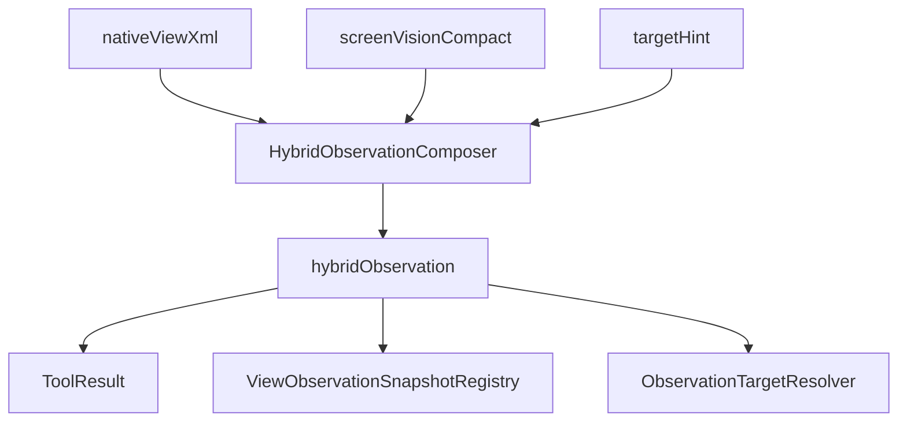

# HybridObservation 字段详解

本文档是《[当前项目业务流程与方案说明](./current-agent-business-flow.md)》的配套文档，专门解释当前系统返回的 `hybridObservation` 结构、生成规则和下游消费方式。

如果你想先建立整体认知，建议先读：

- [当前项目业务流程与方案说明](./current-agent-business-flow.md)
- [当前项目业务流程时序图版](./current-agent-business-flow-sequence.md)

## 1. `hybridObservation` 是什么

`hybridObservation` 是当前系统给模型消费的主页面观察结果。

它不是：

- 原始 `nativeViewXml`
- 原始 `screenVisionCompact`
- 简单把两份结果并排拼起来的 JSON

它是：

- 原生结构信号
- 本地视觉语义信号
- `targetHint` 任务提示
- 匹配、打分、筛选、冲突标注

共同融合后的统一 observation。

当前它由 [HybridObservationComposer.java](../../agent-android/src/main/java/com/hh/agent/android/viewcontext/HybridObservationComposer.java) 生成，并由 [ViewContextSnapshotProvider.java](../../agent-android/src/main/java/com/hh/agent/android/viewcontext/ViewContextSnapshotProvider.java) 放进 `android_view_context_tool` 的返回值中。

## 2. 它在整条链路里的位置



它既是：

- 模型的主输入
- 快照注册的一部分
- 目标选择器的主要数据源
- 调试面板的主要解释对象

## 3. 顶层字段总览

当前 `hybridObservation` 的顶层字段包括：

- `schemaVersion`
- `mode`
- `primarySource`
- `activityClassName`
- `targetHint`
- `summary`
- `executionHint`
- `page`
- `availableSignals`
- `quality`
- `actionableNodes`
- `sections`
- `listItems`
- `conflicts`
- `debug`

这些字段由 [HybridObservationComposer.java](../../agent-android/src/main/java/com/hh/agent/android/viewcontext/HybridObservationComposer.java) 的 `compose(...)` 统一写入。

## 4. 顶层元信息字段

### `schemaVersion`

当前固定为 `1`。

用途：

- 为后续结构升级预留版本位
- 便于下游解析器做兼容判断

### `mode`

可能的值有：

- `hybrid_native_screen`
- `native_only`
- `screen_only`
- `unavailable`

生成逻辑：

- 原生和视觉都有信号时，返回 `hybrid_native_screen`
- 只有原生信号时，返回 `native_only`
- 只有视觉信号时，返回 `screen_only`
- 两边都不可用时，返回 `unavailable`

用途：

- 让模型知道当前 observation 的可靠来源
- 让调试页快速判断当前页面更依赖哪一路信号

### `primarySource`

表示当前这次 tool 调用的主 source，例如：

- `native_xml`
- `screen_snapshot`
- `all`

注意：`primarySource` 不等于最终是否只使用这一条信号。比如 `screen_snapshot` 路径下，provider 仍然会尽量补采 `nativeViewXml`。

### `activityClassName`

表示当前 observation 所对应的页面类名。

用途：

- 调试定位
- 快照归属判断
- 分析不同 Activity 的观测策略表现

### `targetHint`

表示本轮观测所带的任务提示词。

用途：

- 提升与任务相关节点的排序分数
- 让视觉模块在 compact 阶段带着目标意识裁剪
- 帮助 resolver 优先挑选更贴近目标的候选

## 5. 页面级解释字段

### `summary`

这是给模型读的页面级摘要，不是简单的原始视觉 summary 透传。

生成规则大致是：

- 如果视觉有 `summary` 且原生也可用，则返回“视觉摘要 + 原生树节点数 + 已融合匹配数”
- 如果只有视觉 `summary`，则直接使用视觉摘要
- 如果只有原生树，则退化为“原生树共抓到多少节点，以及关键文本是什么”
- 如果两边都不可用，则输出不可用提示

用途：

- 让模型快速建立页面大意
- 避免模型一上来就读全量候选列表

### `executionHint`

这是写给模型和上层 runtime 的显式消费建议。

当前默认含义是：

- 优先使用 `actionableNodes` 中 `source=fused` 或 `source=native` 的节点
- 使用这些节点的 `bounds` 作为 `referencedBounds`
- 把 `vision_only` 当较弱候选

它的作用不是替代算法，而是把当前系统的推荐使用方式明确暴露出来。

## 6. 页面几何与可用信号字段

### `page`

当前包含：

- `width`
- `height`

来源规则：

- 优先使用视觉结果中的页面尺寸
- 如果视觉结果没有有效尺寸，则回退到原生树遍历中看到的最大 `right/bottom`

用途：

- 给模型提供页面整体几何上下文
- 帮助判断候选节点大致位于页面何处

### `availableSignals`

当前包含：

- `nativeXml`
- `screenVisionCompact`
- `visualPageGeometry`

用途：

- 让下游知道本次 observation 依赖了哪些输入信号
- 帮助调试页快速判断当前结果是否缺失某一路输入

## 7. 质量统计字段 `quality`

当前包含：

- `nativeNodeCount`
- `nativeTextNodeCount`
- `visionTextCount`
- `visionControlCount`
- `fusedMatchCount`
- `visionDroppedTextCount`
- `visionDroppedControlCount`

这些字段的业务含义如下：

### `nativeNodeCount`

原生树最终纳入融合解析的节点总数。

### `nativeTextNodeCount`

原生树中含可读文本的节点数。

### `visionTextCount`

视觉结果中 `texts` 的数量。

### `visionControlCount`

视觉结果中 `controls` 的数量。

### `fusedMatchCount`

成功完成 native-vision 双向匹配的节点数。

它是衡量当前融合质量最重要的指标之一。通常来说：

- 值越高，说明两路结果互相印证越充分
- 值越低，说明页面要么视觉识别弱，要么原生结构和视觉布局差异较大

### `visionDroppedTextCount` / `visionDroppedControlCount`

来自视觉 compact 阶段的裁剪丢弃统计。

用途：

- 帮助判断当前视觉结果是否被压缩得过猛
- 为 `conflicts` 中的 `vision_compaction_drop_summary` 提供依据

## 8. 最重要的字段：`actionableNodes`

`actionableNodes` 是当前系统最重要的动作候选池，也是模型最应该优先读取的字段。

### 8.1 作用

它的目标不是“还原全部页面元素”，而是“挑出最值得后续点击、聚焦、引用的目标集合”。

### 8.2 数量上限

当前最多保留 `18` 个候选。

对应常量：

- `MAX_ACTIONABLE = 18`

### 8.3 候选来源类型

每个节点当前有三种来源：

- `fused`
- `native`
- `vision_only`

#### `fused`

表示该节点在原生树和视觉结果之间成功建立了匹配关系。

它通常是最值得信任的候选，因为同时具备：

- 原生结构锚点
- 视觉语义补充

#### `native`

表示当前只有原生树命中，没有视觉匹配。

适合：

- 结构很清晰的原生控件
- 文本型按钮、输入框、列表项

#### `vision_only`

表示当前只有视觉命中，没有原生锚点。

适合：

- 图标按钮
- 视觉型卡片
- 自绘控件

但它天然比 `fused` 和 `native` 更弱，不适合被默认当成最可信动作目标。

### 8.4 单个节点常见字段

根据来源不同，单个 `actionableNode` 可能包含以下字段：

- `id`
- `source`
- `nativeNodeIndex`
- `text`
- `className`
- `resourceId`
- `bounds`
- `bbox`
- `score`
- `actionability`
- `matchScore`
- `matchedVisionId`
- `matchedVisionKind`
- `visionType`
- `visionLabel`
- `visionRole`

### 8.5 字段含义

#### `id`

候选自身的稳定标识。当前原生节点和视觉信号各自会生成自己的 id。

#### `nativeNodeIndex`

来源于原生树节点的 `index`。如果存在，表示当前候选至少锚到了某个原生节点。

#### `text`

当前候选最重要的文本提示。对原生节点通常来自原生文本；对视觉候选通常来自视觉 label。

#### `bounds` / `bbox`

同一组边界信息的两种表示：

- `bounds`：Android 常见字符串形式，例如 `[0,120][300,188]`
- `bbox`：数组形式 `[left, top, right, bottom]`

gesture 层和 resolver 都会依赖这组信息。

#### `score`

当前候选的融合分数，范围在 `0` 到 `1` 之间。

#### `actionability`

根据 `score` 档位映射得到的可操作等级：

- `high`：`score >= 0.80`
- `medium`：`score >= 0.50`
- `low`：其余情况

#### `matchScore`

只对 `fused` 节点存在，表示 native 节点与视觉信号的匹配强度。

#### `visionType` / `visionLabel` / `visionRole`

这些字段只在成功融合或纯视觉候选上出现，主要用于给模型提供额外视觉语义。

### 8.6 生成规则

#### 原生候选进入 `actionableNodes` 的条件

大致规则是：

- 如果没有视觉匹配，且既不 interesting、也没有达到最低分数，则跳过
- 未匹配原生节点的最低保留分约为 `0.34`
- 匹配过视觉结果的节点更容易被保留

#### 视觉候选进入 `actionableNodes` 的条件

大致规则是：

- 必须尚未匹配到原生节点
- 必须是 `actionable(targetHint)`
- 分数必须至少约为 `0.45`

这说明系统对 `vision_only` 是明显保守的。

## 9. `sections` 与 `listItems`

这两个字段不是给 gesture 直接点用的，而是给模型做页面结构理解用的。

### `sections`

表示视觉模块认为比较重要的页面分区。当前最多保留 `8` 个。

### `listItems`

表示视觉模块识别出来的列表项。当前最多保留 `12` 个。

### 常见字段

- `id`
- `type`
- `sectionId`
- `summaryText`
- `bounds`
- `bbox`
- `importance`
- `matchedNativeNodeIds`
- `matchedNativeNodeCount`

对 `sections` 还会有：

- `collapsedItemCount`

对 `listItems` 还会有：

- `textCount`
- `controlCount`

### 业务意义

这两个字段主要解决的是“理解页面组织”而不是“直接点击哪个点”。

例如：

- 某个卡片区里有哪些原生锚点
- 某个列表项和哪些原生节点相关
- 当前页面是不是明显存在列表结构

## 10. `conflicts` 字段

`conflicts` 用来显式表达融合阶段的不一致和风险提示。当前最多保留 `8` 条。

### 常见冲突类型

#### `vision_compaction_drop_summary`

表示视觉 compact 阶段裁剪掉了一定数量的 `texts` 或 `controls`。

用途：

- 提醒当前视觉结果可能有信息损失
- 提示模型或开发者不要过度依赖被压缩后的视觉结果

#### `vision_only_candidate`

表示有高价值视觉候选没有找到原生匹配。

这类候选常见于：

- 图标按钮
- 自绘控件
- 视觉分块异常

#### `native_only_candidate`

表示有高价值原生候选没有找到视觉匹配。

这类候选常见于：

- 视觉漏识别
- OCR 没读出来
- 页面压缩过度

### 阈值规则

当前实现里：

- `vision_only_candidate` 大致要求分数 `>= 0.72`
- `native_only_candidate` 大致要求分数 `>= 0.78`

也就是说，只有比较高价值的单边候选才会被提升为冲突，而不是所有不匹配都被视为问题。

## 11. `debug` 字段

`debug` 是给调试面板和开发排查准备的解释层数据，不是给 gesture 直接消费的主字段。

当前包含：

- `matchPairs`
- `nativeOnlyCandidates`
- `visionOnlyCandidates`
- `topNativeTexts`

### `matchPairs`

表示成功完成融合的 native-vision 配对。

单个项通常包括：

- `nativeId`
- `nativeNodeIndex`
- `nativeText`
- `nativeClassName`
- `nativeResourceId`
- `bounds`
- `visionId`
- `visionKind`
- `visionType`
- `visionLabel`
- `visionRole`
- `visionBounds`
- `matchScore`
- `nativeScore`
- `visionScore`

它是理解“为什么这个节点会是 fused”的最好入口。

### `nativeOnlyCandidates`

表示原生树中比较有价值、但没有成功匹配视觉结果的候选。

当前调试保留阈值大致是 `score >= 0.42`。

### `visionOnlyCandidates`

表示视觉结果中比较有价值、但没有成功匹配原生节点的候选。

当前调试保留阈值大致也是 `score >= 0.42`。

### `topNativeTexts`

表示从原生树中抽取的高频关键文本摘要，用于快速辅助理解当前页面。

## 12. 匹配规则：native 和 vision 是怎么配上的

当前匹配逻辑的核心不是单纯按文本，也不是单纯按位置，而是两者结合。

### 12.1 匹配步骤

1. 为每个 native 节点计算它最优的视觉候选
2. 为每个视觉信号计算它最优的 native 节点
3. 只有当两边互相选择对方，并且分数超过阈值时，才算真正匹配成功

### 12.2 关键阈值

- `MATCH_THRESHOLD = 0.40`

只有双向互选且分数至少达到 `0.40`，该对关系才会变成真正的 `fused`。

### 12.3 匹配分数考虑的因素

主要考虑：

- `bbox` 重叠程度
- 文本相似度
- 对 control/text 类型的不同权重
- exact/near-exact 文本命中带来的额外加分

这也是为什么单纯“位置接近”或者单纯“文本相似”都不足以成为最终融合依据。

## 13. 节点打分规则：为什么某些候选排得更前

### 13.1 `nodeScore`

原生候选的评分会综合这些因素：

- 是否有文本
- 是否有 `resourceId`
- 是否属于可交互类控件
- 是否已经匹配到视觉信号
- `targetHint` 是否命中

### 13.2 `signalScore`

视觉候选的评分会综合这些因素：

- 视觉模型置信度
- 视觉重要度
- 是否为 control
- 是否有文本标签
- 是否符合当前任务目标
- `targetHint` 是否命中

### 13.3 为什么 `fused` 更值得信任

因为它本质上同时满足了两套打分体系：

- 原生结构层认为它重要
- 视觉语义层也认为它重要

## 14. 下游如何消费 `hybridObservation`

### 14.1 Prompt 侧

当前 prompt 和 tool 定义都已经改成了 hybrid-first：

1. 先看 `summary`
2. 再看 `actionableNodes`
3. 再看 `conflicts`
4. 最后才回退到 `nativeViewXml` 和 `screenVisionCompact`

### 14.2 `ObservationTargetResolver`

当前目标解析器会优先读取 `actionableNodes`，并按来源做额外加权：

- `fused` 加 `0.25`
- `native` 加 `0.15`
- `vision_only` 减 `0.10`
- 有 `nativeNodeIndex` 再加 `0.08`

如果提供了 `targetHint`，还会继续计算命中加权。

并且当 `targetHint` 存在时，命中度如果低于大约 `0.42`，该候选会被直接过滤掉。

### 14.3 gesture 侧

gesture 本身并不直接读取 `hybridObservation` 全量结构，但它依赖 resolver 或模型最终选出的：

- `snapshotId`
- `referencedBounds`
- `nativeNodeIndex` 或其等价锚点

所以可以理解为：

- `hybridObservation` 负责让“选谁”更准确
- `android_gesture_tool` 负责让“怎么点”更安全

## 15. 推荐消费顺序

如果你在写上层逻辑，当前推荐顺序是：

1. 先读 `mode` 和 `quality`
2. 再读 `summary`
3. 再读 `actionableNodes`
4. 如果结果可疑，再看 `conflicts`
5. 如果要排查为什么融合异常，再看 `debug`
6. 只有在这些都不足够时，再去看原始 `nativeViewXml` 和 `screenVisionCompact`

## 16. 常见理解误区

### 误区 1：`hybridObservation` 是原始数据备份

不是。它是融合后的决策型 observation，目的是帮助动作选择，而不是完整保留所有底层细节。

### 误区 2：`vision_only` 就等于视觉结果更强

不一定。`vision_only` 更可能意味着：

- 视觉命中了
- 但当前没有原生锚点
- 所以要保守使用

### 误区 3：`fusedMatchCount` 高就一定能正确点击

也不绝对。它说明两路结果一致性更高，但最终点击还要受到：

- `targetHint`
- resolver 排序
- snapshot 是否过期
- gesture 参数是否完整

等因素影响。

## 17. 一个简化示例

```json
{
  "schemaVersion": 1,
  "mode": "hybrid_native_screen",
  "summary": "当前页面包含审批入口卡片，原生树已捕获 86 个节点，并融合 7 个截图匹配。",
  "quality": {
    "nativeNodeCount": 86,
    "visionTextCount": 12,
    "visionControlCount": 6,
    "fusedMatchCount": 7
  },
  "actionableNodes": [
    {
      "id": "n_23",
      "source": "fused",
      "nativeNodeIndex": 23,
      "text": "费用审批中心",
      "bounds": "[48,320][420,408]",
      "score": 0.913,
      "actionability": "high",
      "visionType": "card",
      "visionLabel": "费用审批中心"
    }
  ],
  "conflicts": [],
  "debug": {
    "matchPairs": []
  }
}
```

这个示例的含义是：

- 当前页面两路信号都可用
- 已经有一个非常强的 `fused` 候选
- 模型和 resolver 都应优先围绕它做目标决策

## 18. 字段详解版总结

如果只记 4 件事，可以记住：

1. `hybridObservation` 是当前系统真正给模型消费的主 observation
2. `actionableNodes` 是最重要的动作候选池
3. `conflicts` 和 `debug` 是判断不确定性和排查融合问题的关键辅助信息
4. 当前系统的默认偏好始终是 `fused > native > vision_only`

这也是为什么当前项目的重点不再是“把原生树和截图结果都给出来”，而是“把两者融合成一个更适合动作决策的结构”。
