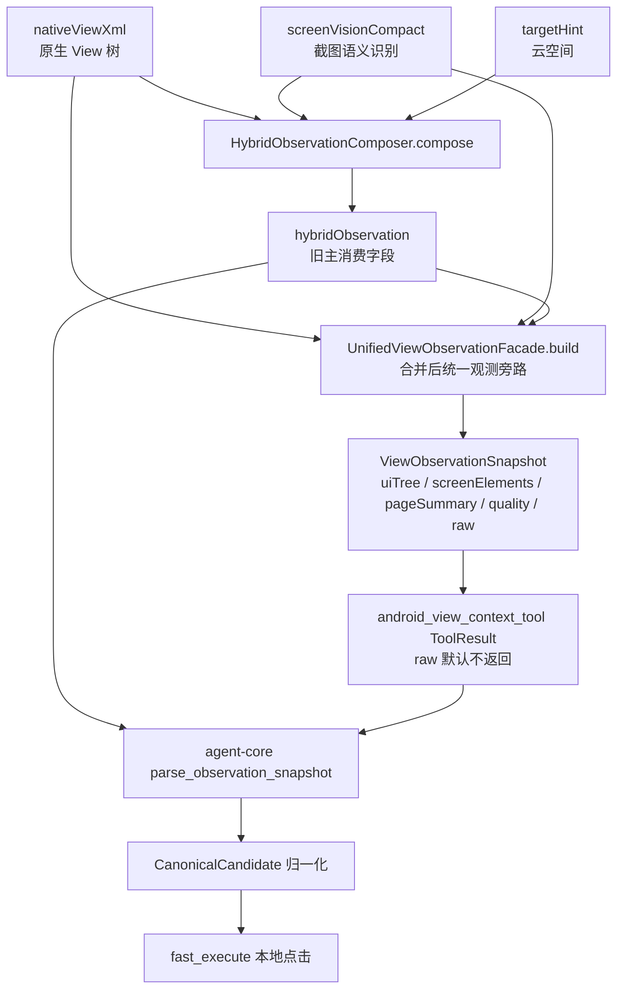
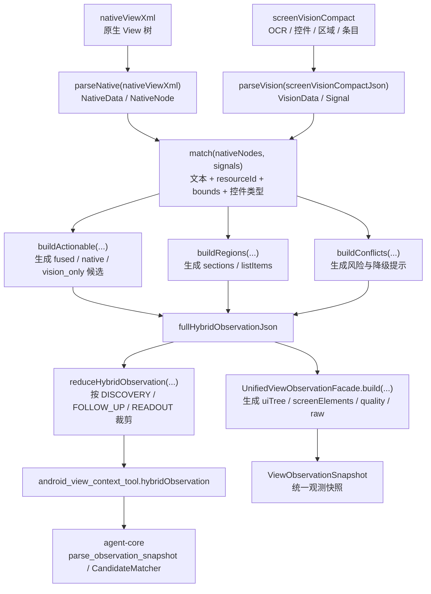

# Me 页面 nativeViewXml / screenVision / hybridObservation 融合示例

本文以 `com.huawei.works.me.fragment.MeMainActivity` 上的“云空间”入口为例，说明 `agent-screen-vision` 的视觉结果如何和原生 `nativeViewXml` 融合，并最终被 `agent-core` 消费为可执行候选。

说明：

- 示例按当前代码字段组织，方便对照 [HybridObservationComposer.java](../../agent-android/src/main/java/com/hh/agent/android/viewcontext/HybridObservationComposer.java) 和 [ViewContextSnapshotProvider.java](../../agent-android/src/main/java/com/hh/agent/android/viewcontext/ViewContextSnapshotProvider.java)。
- 为避免把真实用户头像、姓名、工号等敏感信息落到文档，用户信息做了脱敏。
- 真实设备上的 `nativeViewXml` 可能包含更多装饰性空节点、布局节点和重复容器；本文保留对融合和点击决策有意义的完整字段级样例。
- 坐标以一台 `1080 x 2400` 设备的观测为例，实际机型会有轻微差异。

## 1. 整体链路



融合的核心目标不是“把两份结果并排塞给模型”，而是把它们变成同一套可执行语义：

- `source=fused`：native 节点和 screen vision 信号匹配成功，优先级最高。
- `source=native`：只有原生结构信号，但可点击性、文本、容器关系可靠。
- `source=vision_only`：只有视觉信号，通常作为弱候选或冲突提醒，默认不会压过稳定 native/fused 候选。

## 2. nativeViewXml 输入示例

这是 `MeMainActivity` 中和“云空间”入口相关的一次原生 View 树结果。真实结果由 `InProcessViewHierarchyDumper.dumpHierarchy(...)` 生成，并作为 `nativeViewXml` 放入 `android_view_context_tool` 返回值。

```xml
<?xml version="1.0" encoding="UTF-8"?>
<hierarchy rotation="0" activity="com.huawei.works.me.fragment.MeMainActivity" package="com.huawei.works.uat">
  <node index="0" text="" resource-id="" class="android.widget.FrameLayout" package="com.huawei.works.uat" content-desc="" clickable="false" enabled="true" focusable="false" selected="false" bounds="[0,0][1080,2400]">
    <node index="0" text="" resource-id="android:id/content" class="android.widget.FrameLayout" package="com.huawei.works.uat" content-desc="" clickable="false" enabled="true" focusable="false" selected="false" bounds="[0,72][1080,2400]">
      <node index="0" text="" resource-id="com.huawei.works.uat:id/me_root" class="android.widget.LinearLayout" package="com.huawei.works.uat" content-desc="" clickable="false" enabled="true" focusable="false" selected="false" bounds="[0,72][1080,2400]">
        <node index="0" text="" resource-id="com.huawei.works.uat:id/me_header" class="android.widget.RelativeLayout" package="com.huawei.works.uat" content-desc="" clickable="true" enabled="true" focusable="true" selected="false" bounds="[0,72][1080,438]">
          <node index="0" text="" resource-id="com.huawei.works.uat:id/avatar" class="android.widget.ImageView" package="com.huawei.works.uat" content-desc="头像" clickable="true" enabled="true" focusable="true" selected="false" bounds="[48,142][188,282]" />
          <node index="1" text="高兴" resource-id="com.huawei.works.uat:id/user_name" class="android.widget.TextView" package="com.huawei.works.uat" content-desc="" clickable="false" enabled="true" focusable="false" selected="false" bounds="[220,152][318,197]" />
          <node index="2" text="00612186" resource-id="com.huawei.works.uat:id/user_id" class="android.widget.TextView" package="com.huawei.works.uat" content-desc="" clickable="false" enabled="true" focusable="false" selected="false" bounds="[220,211][374,247]" />
          <node index="3" text="" resource-id="com.huawei.works.uat:id/header_arrow" class="android.widget.ImageView" package="com.huawei.works.uat" content-desc="进入个人信息" clickable="false" enabled="true" focusable="false" selected="false" bounds="[1016,196][1044,224]" />
        </node>

        <node index="1" text="" resource-id="com.huawei.works.uat:id/me_service_grid" class="android.widget.GridLayout" package="com.huawei.works.uat" content-desc="" clickable="false" enabled="true" focusable="false" selected="false" bounds="[24,458][1056,736]">
          <node index="0" text="" resource-id="com.huawei.works.uat:id/service_cloud_space" class="android.widget.LinearLayout" package="com.huawei.works.uat" content-desc="云空间" clickable="true" enabled="true" focusable="true" selected="false" bounds="[72,482][312,698]">
            <node index="0" text="" resource-id="com.huawei.works.uat:id/service_cloud_space_icon" class="android.widget.ImageView" package="com.huawei.works.uat" content-desc="" clickable="false" enabled="true" focusable="false" selected="false" bounds="[160,514][224,578]" />
            <node index="1" text="云空间" resource-id="com.huawei.works.uat:id/service_cloud_space_title" class="android.widget.TextView" package="com.huawei.works.uat" content-desc="" clickable="false" enabled="true" focusable="false" selected="false" bounds="[143,606][241,642]" />
          </node>
          <node index="1" text="" resource-id="com.huawei.works.uat:id/service_cloud_note" class="android.widget.LinearLayout" package="com.huawei.works.uat" content-desc="云笔记" clickable="true" enabled="true" focusable="true" selected="false" bounds="[312,482][552,698]">
            <node index="0" text="" resource-id="com.huawei.works.uat:id/service_cloud_note_icon" class="android.widget.ImageView" package="com.huawei.works.uat" content-desc="" clickable="false" enabled="true" focusable="false" selected="false" bounds="[400,514][464,578]" />
            <node index="1" text="云笔记" resource-id="com.huawei.works.uat:id/service_cloud_note_title" class="android.widget.TextView" package="com.huawei.works.uat" content-desc="" clickable="false" enabled="true" focusable="false" selected="false" bounds="[383,606][481,642]" />
          </node>
          <node index="2" text="" resource-id="com.huawei.works.uat:id/service_card" class="android.widget.LinearLayout" package="com.huawei.works.uat" content-desc="云名片" clickable="true" enabled="true" focusable="true" selected="false" bounds="[552,482][792,698]">
            <node index="0" text="" resource-id="com.huawei.works.uat:id/service_card_icon" class="android.widget.ImageView" package="com.huawei.works.uat" content-desc="" clickable="false" enabled="true" focusable="false" selected="false" bounds="[640,514][704,578]" />
            <node index="1" text="云名片" resource-id="com.huawei.works.uat:id/service_card_title" class="android.widget.TextView" package="com.huawei.works.uat" content-desc="" clickable="false" enabled="true" focusable="false" selected="false" bounds="[623,606][721,642]" />
          </node>
          <node index="3" text="" resource-id="com.huawei.works.uat:id/service_security" class="android.widget.LinearLayout" package="com.huawei.works.uat" content-desc="用户安全中心" clickable="true" enabled="true" focusable="true" selected="false" bounds="[792,482][1032,698]">
            <node index="0" text="" resource-id="com.huawei.works.uat:id/service_security_icon" class="android.widget.ImageView" package="com.huawei.works.uat" content-desc="" clickable="false" enabled="true" focusable="false" selected="false" bounds="[880,514][944,578]" />
            <node index="1" text="用户安全中心" resource-id="com.huawei.works.uat:id/service_security_title" class="android.widget.TextView" package="com.huawei.works.uat" content-desc="" clickable="false" enabled="true" focusable="false" selected="false" bounds="[826,606][998,642]" />
          </node>
        </node>

        <node index="2" text="" resource-id="com.huawei.works.uat:id/me_list" class="android.widget.LinearLayout" package="com.huawei.works.uat" content-desc="" clickable="false" enabled="true" focusable="false" selected="false" bounds="[0,756][1080,2210]">
          <node index="0" text="" resource-id="com.huawei.works.uat:id/item_favorites" class="android.widget.RelativeLayout" package="com.huawei.works.uat" content-desc="收藏" clickable="true" enabled="true" focusable="true" selected="false" bounds="[0,756][1080,868]"><node index="0" text="收藏" resource-id="com.huawei.works.uat:id/title" class="android.widget.TextView" package="com.huawei.works.uat" content-desc="" clickable="false" enabled="true" focusable="false" selected="false" bounds="[96,792][164,832]" /></node>
          <node index="1" text="" resource-id="com.huawei.works.uat:id/item_settings" class="android.widget.RelativeLayout" package="com.huawei.works.uat" content-desc="设置" clickable="true" enabled="true" focusable="true" selected="false" bounds="[0,868][1080,980]"><node index="0" text="设置" resource-id="com.huawei.works.uat:id/title" class="android.widget.TextView" package="com.huawei.works.uat" content-desc="" clickable="false" enabled="true" focusable="false" selected="false" bounds="[96,904][164,944]" /></node>
          <node index="2" text="" resource-id="com.huawei.works.uat:id/item_about" class="android.widget.RelativeLayout" package="com.huawei.works.uat" content-desc="关于" clickable="true" enabled="true" focusable="true" selected="false" bounds="[0,980][1080,1092]"><node index="0" text="关于" resource-id="com.huawei.works.uat:id/title" class="android.widget.TextView" package="com.huawei.works.uat" content-desc="" clickable="false" enabled="true" focusable="false" selected="false" bounds="[96,1016][164,1056]" /></node>
        </node>

        <node index="3" text="" resource-id="com.huawei.works.uat:id/bottom_navigation" class="android.widget.LinearLayout" package="com.huawei.works.uat" content-desc="" clickable="false" enabled="true" focusable="false" selected="false" bounds="[0,2210][1080,2400]">
          <node index="0" text="消息" resource-id="com.huawei.works.uat:id/tab_message" class="android.widget.TextView" package="com.huawei.works.uat" content-desc="" clickable="true" enabled="true" focusable="true" selected="false" bounds="[60,2248][168,2290]" />
          <node index="1" text="通讯录" resource-id="com.huawei.works.uat:id/tab_contacts" class="android.widget.TextView" package="com.huawei.works.uat" content-desc="" clickable="true" enabled="true" focusable="true" selected="false" bounds="[296,2248][428,2290]" />
          <node index="2" text="业务" resource-id="com.huawei.works.uat:id/tab_work" class="android.widget.TextView" package="com.huawei.works.uat" content-desc="" clickable="true" enabled="true" focusable="true" selected="false" bounds="[540,2248][648,2290]" />
          <node index="3" text="我的" resource-id="com.huawei.works.uat:id/tab_me" class="android.widget.TextView" package="com.huawei.works.uat" content-desc="" clickable="true" enabled="true" focusable="true" selected="true" bounds="[884,2248][992,2290]" />
        </node>
      </node>
    </node>
  </node>
</hierarchy>
```

native 结果里的关键点：

- “云空间”有一个可点击父容器：`resource-id=service_cloud_space`，`content-desc=云空间`，`clickable=true`。
- “云空间”也有一个文本子节点：`resource-id=service_cloud_space_title`，`text=云空间`，`clickable=false`。
- 原生树能可靠告诉我们“文本属于哪个父容器”和“父容器是否可点击”，这是纯截图方案很难稳定获得的。

## 3. screenVisionCompact 输入示例

这是 `agent-screen-vision` 对同一帧截图做出的紧凑视觉语义结果。真实结果由宿主侧 `ScreenSnapshotAnalyzer` 返回，并作为 `screenVisionCompact` 进入融合器。

```json
{
  "summary": "Me page with profile header, service shortcut grid, security/settings list, and selected bottom tab. Primary visible targets include 00612186, 云空间, 云笔记, 云名片, 用户安全中心.",
  "page": { "width": 1080, "height": 2400 },
  "texts": [
    { "id": "txt_user_name", "text": "高兴", "bbox": [220, 152, 318, 197], "confidence": 0.99, "importance": 0.74 },
    { "id": "txt_user_id", "text": "00612186", "bbox": [220, 211, 374, 247], "confidence": 0.99, "importance": 0.86 },
    { "id": "txt_cloud_space", "text": "云空间", "bbox": [142, 604, 242, 644], "confidence": 0.99, "importance": 0.96 },
    { "id": "txt_cloud_note", "text": "云笔记", "bbox": [382, 604, 482, 644], "confidence": 0.99, "importance": 0.78 },
    { "id": "txt_cloud_card", "text": "云名片", "bbox": [622, 604, 722, 644], "confidence": 0.98, "importance": 0.72 },
    { "id": "txt_security", "text": "用户安全中心", "bbox": [826, 604, 998, 644], "confidence": 0.98, "importance": 0.70 },
    { "id": "txt_favorites", "text": "收藏", "bbox": [96, 792, 164, 832], "confidence": 0.98, "importance": 0.52 },
    { "id": "txt_settings", "text": "设置", "bbox": [96, 904, 164, 944], "confidence": 0.98, "importance": 0.52 },
    { "id": "txt_about", "text": "关于", "bbox": [96, 1016, 164, 1056], "confidence": 0.97, "importance": 0.44 },
    { "id": "txt_tab_me", "text": "我的", "bbox": [884, 2248, 992, 2290], "confidence": 0.98, "importance": 0.62 }
  ],
  "controls": [
    { "id": "ctl_avatar", "type": "image", "label": "头像", "role": "profile_entry", "bbox": [48, 142, 188, 282], "confidence": 0.93, "importance": 0.66 },
    { "id": "ctl_cloud_space_card", "type": "card", "label": "云空间", "role": "shortcut", "bbox": [72, 482, 312, 698], "confidence": 0.96, "importance": 0.98 },
    { "id": "ctl_cloud_space_icon", "type": "icon", "label": "云空间", "role": "shortcut_icon", "bbox": [160, 514, 224, 578], "confidence": 0.91, "importance": 0.77 },
    { "id": "ctl_cloud_note_card", "type": "card", "label": "云笔记", "role": "shortcut", "bbox": [312, 482, 552, 698], "confidence": 0.95, "importance": 0.73 },
    { "id": "ctl_cloud_card", "type": "card", "label": "云名片", "role": "shortcut", "bbox": [552, 482, 792, 698], "confidence": 0.94, "importance": 0.69 },
    { "id": "ctl_security_card", "type": "card", "label": "用户安全中心", "role": "shortcut", "bbox": [792, 482, 1032, 698], "confidence": 0.94, "importance": 0.67 },
    { "id": "ctl_settings_row", "type": "row", "label": "设置", "role": "list_item", "bbox": [0, 868, 1080, 980], "confidence": 0.92, "importance": 0.49 },
    { "id": "ctl_tab_me", "type": "tab", "label": "我的", "role": "bottom_tab_selected", "bbox": [820, 2210, 1080, 2400], "confidence": 0.94, "importance": 0.58 }
  ],
  "sections": [
    { "id": "sec_profile", "type": "header", "summaryText": "profile: 高兴 00612186", "bbox": [0, 72, 1080, 438], "importance": 0.82, "textCount": 2, "controlCount": 2 },
    { "id": "sec_shortcuts", "type": "grid", "summaryText": "shortcut grid: 云空间, 云笔记, 云名片, 用户安全中心", "bbox": [24, 458, 1056, 736], "importance": 0.96, "textCount": 4, "controlCount": 4 },
    { "id": "sec_settings", "type": "list", "summaryText": "settings list: 收藏, 设置, 关于", "bbox": [0, 756, 1080, 1092], "importance": 0.58, "textCount": 3, "controlCount": 3 }
  ],
  "items": [
    { "id": "item_cloud_space", "type": "grid_item", "sectionId": "sec_shortcuts", "summaryText": "云空间", "bbox": [72, 482, 312, 698], "importance": 0.98, "textCount": 1, "controlCount": 2 },
    { "id": "item_cloud_note", "type": "grid_item", "sectionId": "sec_shortcuts", "summaryText": "云笔记", "bbox": [312, 482, 552, 698], "importance": 0.73, "textCount": 1, "controlCount": 1 },
    { "id": "item_cloud_card", "type": "grid_item", "sectionId": "sec_shortcuts", "summaryText": "云名片", "bbox": [552, 482, 792, 698], "importance": 0.69, "textCount": 1, "controlCount": 1 },
    { "id": "item_security", "type": "grid_item", "sectionId": "sec_shortcuts", "summaryText": "用户安全中心", "bbox": [792, 482, 1032, 698], "importance": 0.67, "textCount": 1, "controlCount": 1 }
  ],
  "debug": { "dropSummary": { "texts": [], "controls": [] } }
}
```

screen vision 的关键价值：

- 能从截图中确认“云空间”确实可见，且位置和 native 文本节点基本重合。
- 能给出区域级语义，例如 `shortcut grid`、`grid_item`、`card`。
- 对原生树缺少语义的 icon/card，可补充视觉上的 `label`、`role` 和 `importance`。

## 4. 融合后的 hybridObservation 示例

下面是 `HybridObservationComposer.compose(...)` 融合后的结果。它会作为 `android_view_context_tool` 的主观察结果进入 `agent-core`。

### 4.1 native + screen vision 输入融合说明图

`hybridObservation` 的生成不是简单把两份 JSON 拼在一起，而是先把 native 和 screen vision 都转换成可比较的中间信号，再通过文本、语义、bounds 和可执行性做匹配。融合后的结果既保留 native 的稳定结构，又吸收 screen vision 的视觉语义。



这张图里有两条输出路径：

- `hybridObservation` 是当前 Agent 本地导航和 fast execute 的主要输入，尤其是 `actionableNodes`。
- `UnifiedViewObservation` 是 merge 后新增的统一观测旁路，用于把 native、screen vision、web dom 等来源收敛到 `uiTree/screenElements/pageSummary/quality/raw` 结构。

### 4.1.1 代码级融合流程

当前代码入口在 `ViewContextSnapshotProvider.buildObservationToolResult(...)`。它会先拿到 native dump 和 screen vision 结果，然后调用 `HybridObservationComposer.compose(...)`：

```java
String visualObservationJson = analysis != null ? analysis.compactObservationJson : null;
String fullHybridObservationJson = HybridObservationComposer.compose(
        source,
        activityClassName,
        targetHint,
        nativeViewXml,
        visualObservationJson,
        imageWidth != null ? imageWidth : 0,
        imageHeight != null ? imageHeight : 0
);
```

`HybridObservationComposer.compose(...)` 内部主流程是：

```java
NativeData nativeData = parseNative(nativeViewXml);
VisionData visionData = parseVision(screenVisionCompactJson, imageWidth, imageHeight);
match(nativeData.nodes, visionData.signals);
result.put("actionableNodes", buildActionable(nativeData, visionData, targetHint));
result.put("sections", buildRegions(visionData.sections, nativeData.nodes, MAX_SECTIONS, true));
result.put("listItems", buildRegions(visionData.items, nativeData.nodes, MAX_ITEMS, false));
result.put("conflicts", buildConflicts(nativeData, visionData, targetHint));
```

各步骤的职责如下：

- `parseNative(nativeViewXml)`：把 XML 中的 node 转成 `NativeNode`，保留 `text/contentDescription/resourceId/className/bounds/clickable/enabled/selected/parentSemanticContext` 等字段。native 的价值是稳定结构、真实点击状态和父子层级。
- `parseVision(screenVisionCompactJson)`：把 OCR 文本、视觉控件、页面 section 和 item 转成 `Signal`。screen vision 的价值是补充“卡片/图标/区域”的视觉语义，例如 `云空间` 是快捷入口卡片，而不只是一个 TextView。
- `match(nativeData.nodes, visionData.signals)`：对每个 native node 和 vision signal 计算匹配分，满足 `MATCH_THRESHOLD=0.40` 且互相都是最佳匹配时，才把 native node 标记为 `matched`，后续输出为 `source=fused`。
- `buildActionable(...)`：先输出 native/fused 候选，再补充高价值且未匹配的 `vision_only` 候选；最后按 `score` 排序并限制 `MAX_ACTIONABLE=18`。这一步决定哪些候选会进入 agent-core 的本地点击决策。
- `buildRegions(...)`：把 screen vision 的 `sections/items` 映射成 `sections/listItems`，并统计区域内匹配到的 native 节点数量，用于页面理解和 readout。
- `buildConflicts(...)`：记录视觉高置信但 native 无匹配的候选，例如 `vision_only_candidate`。它不会直接否定 fused/native 候选，但会提醒后续执行器谨慎处理纯视觉目标。
- `buildDebug(...)`：输出 `nativeTopTexts/matchedNativeNodeIds/visionOnlySignalIds` 等调试信息，只用于定位问题，不应该长期作为 prompt 的核心内容。

### 4.1.2 matchScore 匹配分计算方式

`match(nativeData.nodes, visionData.signals)` 会遍历每一个 native node 和每一个 screen vision signal，调用 `matchScore(node, signal)` 计算它们是否像是同一个 UI 元素。这个分数完全在本地计算，不经过 LLM。

当前匹配分主要由两部分组成：

- `overlap`：native bounds 和 vision bounds 的空间重叠程度。
- `text`：native 文本或 resource-id 派生文本，与 vision label 的文本相似度。

核心公式如下：

```java
double overlap = overlap(node.bounds, signal.bounds);
double text = Math.max(
        textMatch(node.text, signal.label),
        textMatch(resourceHint(node.resourceId), signal.label)
);

if (overlap <= 0.02d && text < 0.72d) {
    return 0d;
}

double score = overlap * (signal.isControl() ? 0.58d : 0.68d)
        + text * (signal.isControl() ? 0.42d : 0.32d);

if (text >= 0.95d && overlap >= 0.20d) {
    score += 0.08d;
}

return clamp(score);
```

这里有几个关键设计点：

- 如果空间几乎不重叠，并且文本也不够像，直接返回 `0`。这能过滤掉页面里大量同名或弱相关元素。
- 如果 vision signal 是 `control`，文本权重更高，公式是 `overlap * 0.58 + text * 0.42`。这是因为视觉控件、卡片、图标的 bbox 可能覆盖较大区域，不能完全依赖 IoU。
- 如果 vision signal 是普通文本，空间权重更高，公式是 `overlap * 0.68 + text * 0.32`。这是因为 OCR 文本通常应该和 native TextView 的位置高度贴合。
- 如果文本几乎完全一致，并且空间有一定重叠，会额外加 `0.08`，让“同文案 + 同位置”的融合更稳定。
- 最后通过 `clamp(score)` 把分数限制在 `0~1`。

`overlap(...)` 不是单纯 IoU，而是取 `IoU` 和“小区域覆盖率”的较大值：

```java
double iou = intersection / union;
double coverage = intersection / Math.min(left.area(), right.area());
return clamp(Math.max(iou, coverage * 0.92d));
```

这样做是为了处理常见的父子结构：一个 native 文本节点可能很小，但它完整落在 screen vision 识别出的卡片区域里。如果只用 IoU，小文本和大卡片的交并比会很低；加入 `coverage` 后，可以识别出“小节点属于大区域”的关系。

`textMatch(...)` 会先做 normalize：转小写，并去掉 `_`、`-`、空格和换行。然后按下面规则给分：

| 文本关系 | 分数 |
| --- | --- |
| 完全一致 | `1.0` |
| 一方包含另一方 | `0.88` |
| 字符覆盖率 `>= 75%` | `0.72` |
| 字符覆盖率 `>= 50%` | `0.48` |
| 字符覆盖率 `>= 30%` | `0.28` |
| 其他情况 | `0` |

`resourceHint(node.resourceId)` 会把 `com.huawei.works.uat:id/service_cloud_space_title` 这类 resource-id 简化成类似 `service cloud space title` 的文本，再和 vision label 比较。这样即使 native 节点没有直接文本，也有机会通过 resource-id 参与匹配。

#### bestSignal / bestNode 如何产生

`match(...)` 不是只找一个全局最高分，而是会站在 native 和 vision 两个视角分别记录“最像自己的对方”。遍历过程中，每一个 native node 都会和每一个 vision signal 计算一次 `matchScore(node, signal)`：

```text
native node A x vision signal 1 -> score
native node A x vision signal 2 -> score
native node A x vision signal 3 -> score

native node B x vision signal 1 -> score
native node B x vision signal 2 -> score
native node B x vision signal 3 -> score
```

然后分别更新两边的最佳候选：

```java
if (score > node.bestScore
        || (almostEqual(score, node.bestScore)
            && preferSignalForNode(node, signal, node.bestSignal))) {
    node.bestScore = score;
    node.bestSignal = signal;
}

if (score > signal.bestScore
        || (almostEqual(score, signal.bestScore)
            && preferNodeForSignal(signal, node, signal.bestNode))) {
    signal.bestScore = score;
    signal.bestNode = node;
}
```

含义是：

- `node.bestSignal`：对这个 native node 来说，当前所有 vision signals 中分数最高、最像自己的视觉信号。
- `signal.bestNode`：对这个 vision signal 来说，当前所有 native nodes 中分数最高、最像自己的原生节点。

当两个候选分数几乎一样时，会进入 tie-break，而不是随机选一个：

- `preferSignalForNode(...)`：如果 native node 是交互控件，优先选择 vision control；然后比较文本匹配度；再比较 vision 的 `importance`；最后比较 `confidence`。
- `preferNodeForSignal(...)`：如果 vision signal 是 control/card/button，优先选择 native 里的交互控件；然后比较文本匹配度；最后选择 XML 中 index 更靠前的节点，保证结果稳定。

这样做可以让“文本子节点”和“可点击父容器”分别找到更合理的视觉对象。例如：

```text
N1 = TextView(text="云空间", bounds 小)
N2 = LinearLayout(resourceId="service_cloud_space", clickable=true, bounds 大)

V1 = text(label="云空间", bounds 小)
V2 = control(label="云空间", type="card", bounds 大)
```

理想情况下会形成：

```text
N1.bestSignal = V1
V1.bestNode = N1

N2.bestSignal = V2
V2.bestNode = N2
```

也就是说，小文本更容易和 OCR 文本配对，可点击父容器更容易和视觉卡片配对。

#### 互为最佳匹配如何生效

计算出所有 pair 的分数后，代码不会只看“分数是否过线”，还要求 native node 和 vision signal **互为最佳匹配**：

```java
if (node.bestSignal != null
        && node.bestScore >= MATCH_THRESHOLD
        && node.bestSignal.bestNode == node) {
    node.matched = node.bestSignal;
    node.matchScore = node.bestScore;
    node.bestSignal.matchedNode = node;
}
```

其中 `MATCH_THRESHOLD=0.40`。这个互为最佳的约束很重要：如果一个 vision 卡片同时覆盖多个 native 子节点，或者一个 native 父容器附近有多个视觉信号，只有双方最认可的一组才会变成 `source=fused`，其他候选会继续以 `native` 或 `vision_only` 形式保留。

可以把它理解成“不是我喜欢你就行，而是我最喜欢你，并且你也最喜欢我”。例如：

```text
N1.bestSignal = V2
V2.bestNode = N2
```

这种情况下，即使 `N1 x V2` 的分数超过 `0.40`，`N1` 也不会和 `V2` fused，因为从 `V2` 的视角看，`N2` 才是更像自己的 native 节点。这个机制主要用于避免一个大视觉卡片同时融合多个 native 子节点，降低重复候选和误融合。

以 Me 页“云空间”为例：

- `service_cloud_space_title` 文本节点和 `txt_cloud_space` OCR 文本，`textMatch` 接近 `1.0`，bounds 也重叠，因此容易成为 `fused`。
- `service_cloud_space` 父容器和 `ctl_cloud_space_card` 视觉卡片，bounds 高度重叠，并且 resource-id 里有 `cloud space` 语义，因此也容易成为 `fused`。
- `ctl_cloud_space_icon` 如果没有稳定 native 节点互为最佳匹配，就不会强行 fused，而是作为 `vision_only_candidate` warning 输出。

当前实现的一个边界是：`matchScore(...)` 主要比较 `node.text` 和 `resourceHint(node.resourceId)`，没有直接把 `node.contentDescription` 纳入文本相似度。因此只有 `content-desc`、没有 text/resource-id 语义的控件，更多依赖 bounds 重叠完成融合。后续如果要提升无障碍描述较完整页面的融合质量，可以把 `contentDescription` 加入 `text` 相似度候选。

### 4.1.3 Me 页“云空间”融合过程

以 Me 页“云空间”为例，native 和 screen vision 的输入会在融合时形成下面的对应关系：

| 输入来源 | 示例信号 | 提供的信息 | 融合后的作用 |
| --- | --- | --- | --- |
| native 父容器 | `service_cloud_space` / `android.widget.LinearLayout` | `clickable=true`、完整卡片 bounds、resourceId 稳定 | 作为最终点击候选，输出 `anchorType=card` |
| native 文本子节点 | `service_cloud_space_title` / `TextView` / `text=云空间` | 稳定文本、父容器语义、文本 bounds | 作为语义锚点，输出 `containerClickable=true` |
| screen vision 文本 | `txt_cloud_space` | OCR 确认“云空间”可见 | 与 native 文本融合，增强可见性置信 |
| screen vision 卡片 | `ctl_cloud_space_card` | 视觉上它是快捷入口卡片，importance 较高 | 与 native 父容器融合，增强点击候选排序 |
| screen vision 图标 | `ctl_cloud_space_icon` | 识别到云空间图标，但 native 匹配不稳定 | 输出为 `vision_only_candidate` warning，不优先点击 |

最终会出现两个稳定候选：

- `n8 source=fused anchorType=text containerClickable=true`：说明文本“云空间”可信，但它本身不是最佳点击区域。
- `n6 source=fused anchorType=card clickable=true`：说明父卡片既有 native 可点击性，又有 screen vision 的卡片语义，更适合作为最终 tap bounds。

这也是融合设计的核心：**用 native 决定能不能点、点哪里；用 screen vision 确认视觉上是什么、是否可见、属于哪个区域。**

```json
{
  "schemaVersion": 1,
  "mode": "hybrid_native_screen",
  "primarySource": "native_xml",
  "activityClassName": "com.huawei.works.me.fragment.MeMainActivity",
  "targetHint": "云空间",
  "summary": "Me page with profile header, service shortcut grid, security/settings list, and selected bottom tab. Primary visible targets include 00612186, 云空间, 云笔记, 云名片, 用户安全中心. Native tree captured 31 nodes and fused 18 screenshot matches.",
  "executionHint": "Prefer actionableNodes with source=fused or native and use their bounds as referencedBounds. Treat vision_only nodes as weaker candidates.",
  "page": { "width": 1080, "height": 2400 },
  "availableSignals": { "nativeXml": true, "screenVisionCompact": true },
  "quality": {
    "nativeNodeCount": 31,
    "nativeTextNodeCount": 13,
    "visionTextCount": 10,
    "visionControlCount": 8,
    "fusedMatchCount": 18,
    "visionDroppedTextCount": 0,
    "visionDroppedControlCount": 0
  },
  "actionableNodes": [
    {
      "id": "n8",
      "source": "fused",
      "nativeNodeIndex": 8,
      "text": "云空间",
      "className": "android.widget.TextView",
      "resourceId": "com.huawei.works.uat:id/service_cloud_space_title",
      "region": "upper_left",
      "anchorType": "text",
      "containerRole": "grid_item",
      "parentSemanticContext": "云空间 service_cloud_space android.widget.LinearLayout me_service_grid",
      "bounds": { "left": 143, "top": 606, "right": 241, "bottom": 642, "centerX": 192, "centerY": 624 },
      "score": 1.0,
      "actionability": "high",
      "clickable": false,
      "containerClickable": true,
      "enabled": true,
      "selected": false,
      "badgeLike": false,
      "numericLike": false,
      "decorativeLike": false,
      "repeatGroup": true,
      "matchScore": 0.97,
      "matchedVisionId": "txt_cloud_space",
      "matchedVisionKind": "text",
      "visionType": "text",
      "visionLabel": "云空间",
      "visionRole": null
    },
    {
      "id": "n6",
      "source": "fused",
      "nativeNodeIndex": 6,
      "contentDescription": "云空间",
      "className": "android.widget.LinearLayout",
      "resourceId": "com.huawei.works.uat:id/service_cloud_space",
      "region": "upper_left",
      "anchorType": "card",
      "containerRole": "grid_item",
      "parentSemanticContext": "me_service_grid android.widget.GridLayout",
      "bounds": { "left": 72, "top": 482, "right": 312, "bottom": 698, "centerX": 192, "centerY": 590 },
      "score": 0.97,
      "actionability": "high",
      "clickable": true,
      "containerClickable": false,
      "enabled": true,
      "selected": false,
      "badgeLike": false,
      "numericLike": false,
      "decorativeLike": false,
      "repeatGroup": false,
      "matchScore": 0.94,
      "matchedVisionId": "ctl_cloud_space_card",
      "matchedVisionKind": "control",
      "visionType": "card",
      "visionLabel": "云空间",
      "visionRole": "shortcut"
    },
    {
      "id": "n11",
      "source": "fused",
      "nativeNodeIndex": 11,
      "text": "云笔记",
      "className": "android.widget.TextView",
      "resourceId": "com.huawei.works.uat:id/service_cloud_note_title",
      "region": "upper_center",
      "anchorType": "text",
      "containerRole": "grid_item",
      "bounds": { "left": 383, "top": 606, "right": 481, "bottom": 642, "centerX": 432, "centerY": 624 },
      "score": 0.73,
      "actionability": "medium",
      "clickable": false,
      "containerClickable": true,
      "enabled": true,
      "selected": false,
      "repeatGroup": true,
      "matchScore": 0.96,
      "matchedVisionId": "txt_cloud_note",
      "matchedVisionKind": "text",
      "visionType": "text",
      "visionLabel": "云笔记"
    },
    {
      "id": "v2",
      "source": "vision_only",
      "text": "云空间",
      "visionType": "icon",
      "visionRole": "shortcut_icon",
      "region": "upper_left",
      "anchorType": "icon",
      "containerRole": "grid_item",
      "bounds": { "left": 160, "top": 514, "right": 224, "bottom": 578, "centerX": 192, "centerY": 546 },
      "score": 0.83,
      "actionability": "high",
      "clickable": true,
      "containerClickable": false,
      "enabled": true,
      "selected": false,
      "badgeLike": false,
      "numericLike": false,
      "decorativeLike": false,
      "repeatGroup": false
    }
  ],
  "sections": [
    { "id": "sec_profile", "type": "header", "summaryText": "profile: 高兴 00612186", "bbox": [0, 72, 1080, 438], "importance": 0.82, "matchedNativeNodeCount": 4, "textCount": 2, "controlCount": 2 },
    { "id": "sec_shortcuts", "type": "grid", "summaryText": "shortcut grid: 云空间, 云笔记, 云名片, 用户安全中心", "bbox": [24, 458, 1056, 736], "importance": 0.96, "matchedNativeNodeCount": 12, "textCount": 4, "controlCount": 4 },
    { "id": "sec_settings", "type": "list", "summaryText": "settings list: 收藏, 设置, 关于", "bbox": [0, 756, 1080, 1092], "importance": 0.58, "matchedNativeNodeCount": 6, "textCount": 3, "controlCount": 3 }
  ],
  "listItems": [
    { "id": "item_cloud_space", "type": "grid_item", "sectionId": "sec_shortcuts", "summaryText": "云空间", "bbox": [72, 482, 312, 698], "importance": 0.98, "matchedNativeNodeCount": 3, "textCount": 1, "controlCount": 2 },
    { "id": "item_cloud_note", "type": "grid_item", "sectionId": "sec_shortcuts", "summaryText": "云笔记", "bbox": [312, 482, 552, 698], "importance": 0.73, "matchedNativeNodeCount": 3, "textCount": 1, "controlCount": 1 },
    { "id": "item_cloud_card", "type": "grid_item", "sectionId": "sec_shortcuts", "summaryText": "云名片", "bbox": [552, 482, 792, 698], "importance": 0.69, "matchedNativeNodeCount": 3, "textCount": 1, "controlCount": 1 },
    { "id": "item_security", "type": "grid_item", "sectionId": "sec_shortcuts", "summaryText": "用户安全中心", "bbox": [792, 482, 1032, 698], "importance": 0.67, "matchedNativeNodeCount": 3, "textCount": 1, "controlCount": 1 }
  ],
  "conflicts": [
    {
      "code": "vision_only_candidate",
      "severity": "warning",
      "message": "Screen vision found an actionable candidate that has no stable native node match.",
      "visionId": "ctl_cloud_space_icon",
      "visionKind": "control",
      "visionType": "icon",
      "visionLabel": "云空间",
      "bounds": { "left": 160, "top": 514, "right": 224, "bottom": 578, "centerX": 192, "centerY": 546 },
      "nearbyNativeNodeIds": ["n6", "n8"]
    }
  ],
  "debug": {
    "targetHint": "云空间",
    "nativeTopTexts": ["高兴", "00612186", "云空间", "云笔记", "云名片", "用户安全中心", "收藏", "设置", "关于", "我的"],
    "matchedNativeNodeIds": ["n1", "n2", "n6", "n8", "n9", "n11", "n12", "n14", "n15", "n17"],
    "visionOnlySignalIds": ["ctl_cloud_space_icon"]
  }
}
```

### 4.2 hybridObservation 字段说明

`hybridObservation` 的字段可以分成三类：页面级上下文、候选级执行信息、融合诊断信息。Agent 执行时不会等价使用所有字段，其中 `actionableNodes` 是本地导航和 fast execute 最关键的输入，`sections/listItems/summary` 更多用于页面理解和 readout，`conflicts/debug` 主要服务诊断和风险判断。

页面级字段：

- `schemaVersion`：结构版本号，用于后续兼容不同版本的 hybrid observation。
- `mode`：表示当前融合模式。`hybrid_native_screen` 说明 native view tree 和 screen vision 都参与了融合；如果缺少视觉结果，可能退化为 native-only。
- `primarySource`：主观测来源。Me 页来自原生 View 树，所以是 `native_xml`。
- `activityClassName`：当前页面 Activity，用于判断页面是否到达目标页，也可辅助 `StopConditionSpec` 命中。
- `targetHint`：本轮观测的目标提示，例如 `云空间`。它会影响融合排序、候选筛选和后续 `CandidateMatcher` 的目标匹配。
- `summary`：页面摘要，给 LLM 或 readout 阶段快速理解页面内容。它不是点击依据，只是压缩后的页面语义。
- `executionHint`：给 agent-core 的执行建议，强调优先使用 `fused/native` 候选，谨慎使用 `vision_only`。
- `page`：屏幕尺寸，用于判断区域、角落、列表位置，也能帮助坐标归一化。
- `availableSignals`：说明哪些输入信号可用。这里 `nativeXml=true` 且 `screenVisionCompact=true`，代表本次观测可以做 native + vision 融合。
- `quality`：融合质量统计。`nativeNodeCount`、`visionTextCount`、`visionControlCount` 反映输入规模；`fusedMatchCount` 越高，说明 native 与 vision 匹配越充分；`visionDropped*Count` 用于判断视觉结果是否被大量过滤。

`actionableNodes` 候选字段：

- `id`：候选节点 ID，通常来自 native 节点或视觉信号，方便日志和冲突定位。
- `source`：候选来源。`fused` 代表 native 和 vision 成功配对，稳定性最高；`native` 代表只有原生结构；`vision_only` 代表只有截图识别，需要更谨慎。
- `nativeNodeIndex`：对应 native XML 节点序号，用于回溯原始 View 树。
- `text` / `contentDescription`：候选的可见文本或无障碍描述，是目标匹配的主要语义来源。
- `className` / `resourceId`：native 结构身份。`resourceId` 往往比 OCR 文本更稳定，适合做同类页面的规则化匹配。
- `region`：候选所在屏幕区域，例如 `upper_left`。它用于约束角落入口、底部 Tab、卡片区等通用 UI 位置。
- `anchorType`：候选锚点类型，例如 `text`、`card`、`icon`。文本节点常作为语义锚点，卡片/按钮更适合作为最终点击目标。
- `containerRole`：候选所属容器角色，例如 `grid_item`、`list_item`、`bottom_tab`，帮助区分同名文本在不同 UI 区域里的含义。
- `parentSemanticContext`：父容器语义上下文。像 `云空间 service_cloud_space ...` 可以把不可点击文本节点和可点击父容器关联起来。
- `bounds`：候选坐标和中心点。fast execute 最终会把选中的 bounds 写入 `android_gesture_tool.observation.referencedBounds`，避免让模型猜坐标。
- `score`：综合置信分，结合文本匹配、来源、可点击性、视觉重要性等因素。
- `actionability`：可执行性等级。`high` 更适合直接点击，`medium/low` 更倾向于作为辅助语义。
- `clickable`：当前节点自身是否可点击。示例中 `n6` 是可点击卡片，`n8` 文本自身不可点击。
- `containerClickable`：当前节点自身不可点时，父容器是否可点。示例中 `n8` 的 `containerClickable=true`，说明它可作为语义锚点并向父容器找点击区域。
- `enabled` / `selected`：控件状态。禁用态不能点击，选中态可用于判断底部 Tab 或当前页面状态。
- `badgeLike` / `numericLike` / `decorativeLike`：噪声特征。徽标、数字、装饰图标通常不应作为主点击目标。
- `repeatGroup`：候选是否处在重复结构里，例如网格卡片或列表。它会提示 agent-core 做父子候选归一化，避免把同一个入口拆成多个目标。
- `matchScore`：native 节点和视觉信号的匹配分。它比 `score` 更聚焦于“这两个来源是不是同一个 UI 元素”。
- `matchedVisionId` / `matchedVisionKind`：匹配到的 screen vision 信号 ID 和类型，用于解释 `fused` 来源。
- `visionType` / `visionLabel` / `visionRole`：视觉侧识别出的控件类型、文本和角色，用于补强 native 语义。

结构化页面字段：

- `sections`：页面区域摘要，例如 profile header、shortcut grid、settings list。它适合帮助 LLM 理解页面布局，也适合 readout 阶段做内容分组。
- `listItems`：区域内的条目摘要，例如每个快捷入口卡片。它比 `sections` 更细，但通常仍是理解辅助，不直接替代 `actionableNodes`。
- `bbox`：视觉区域坐标，格式是 `[left, top, right, bottom]`。它用于描述一块区域，不一定是最终点击 bounds。
- `importance`：视觉重要性分，用于排序页面内容，但不能单独决定点击。
- `matchedNativeNodeCount`：该区域匹配到的 native 节点数量，数量越高通常说明结构更稳定。
- `textCount` / `controlCount`：区域内文本和控件数量，帮助判断区域是内容区、入口区还是操作区。

风险与诊断字段：

- `conflicts`：融合中的风险项。示例里的 `vision_only_candidate` 表示视觉发现了“云空间”图标，但没有稳定 native 节点匹配，因此只能作为 warning，而不应优先点击。
- `severity`：冲突等级。`warning` 通常不会阻断高置信 fused/native 候选；真正高风险冲突才应该触发 fallback。
- `nearbyNativeNodeIds`：视觉候选附近的 native 节点，用于判断是否能被已有 native/fused 候选吸收。
- `debug`：调试信息，包括 `nativeTopTexts`、`matchedNativeNodeIds`、`visionOnlySignalIds`。这些字段主要用于日志和问题定位，不应作为长期 prompt 的核心内容。

融合后可以看到三个重要变化：

- 文本子节点 `n8` 和视觉文本 `txt_cloud_space` 融合成 `source=fused`，分数最高。
- 可点击父容器 `n6` 和视觉卡片 `ctl_cloud_space_card` 也融合成 `source=fused`，可作为点击目标。
- 单独的图标识别 `ctl_cloud_space_icon` 因为没有稳定 native 节点匹配，被标记成 `vision_only_candidate` warning，而不是直接阻断稳定候选。

## 5. agent-core 中的候选归一化结果

`agent-core` 不会直接把每个 `actionableNodes` 都当成独立点击目标，而是会做一层 `CanonicalCandidate` 归一化。

归一化前可能有这些候选：

```json
[
  { "label": "云空间", "source": "fused", "bounds": [143, 606, 241, 642], "clickable": false, "containerClickable": true, "member": "text child" },
  { "label": "云空间", "source": "fused", "bounds": [72, 482, 312, 698], "clickable": true, "containerClickable": false, "member": "parent card" },
  { "label": "云空间", "source": "vision_only", "bounds": [160, 514, 224, 578], "clickable": true, "containerClickable": false, "member": "icon" }
]
```

归一化后会合并为一个可点击概念：

```json
{
  "display_label": "云空间",
  "tap_bounds": { "left": 72, "top": 482, "right": 312, "bottom": 698, "centerX": 192, "centerY": 590 },
  "source_set": ["fused", "vision_only"],
  "source": "fused",
  "actionability_rank": 5,
  "risk_flags": ["repeat_group"],
  "member_count": 3,
  "members": [
    "native text child matched with txt_cloud_space",
    "native clickable parent matched with ctl_cloud_space_card",
    "vision-only icon ctl_cloud_space_icon"
  ]
}
```

这里 `source` 最终被提升为 `fused` 的原因是：

- cluster 内包含稳定 native/fused 成员；
- cluster 内也包含 vision-only icon；
- vision-only 只是补充视觉语义，不应该把整个入口降级成纯视觉候选；
- 因此 fast execute 可以忽略低风险 `vision_only_candidate` warning。

对应日志形态通常是：

```text
[AgentLoop][canonical_candidate_selected] target=云空间 display_label=云空间 source_set=fused,vision_only actionability_rank=5 risk_flags=repeat_group
[AgentLoop][fast_execute_conflict_ignored] code=vision_only_candidate candidate=云空间 candidate_source=fused reason=stable_exact_target_candidate
[AgentLoop][fast_execute_hit] action=tap target=云空间 source=fused score=1
```

## 6. 为什么这种融合比单独使用截图更稳

如果只使用 screen vision：

- 模型能看到“云空间”文字和图标，但不知道哪个父容器是真正可点击的。
- 图标、文字、卡片可能被识别成 2 到 3 个候选，容易出现“候选歧义”。
- 页面上头像、图标、列表入口很多时，纯视觉 warning 会变多。

如果只使用 nativeViewXml：

- 能知道父容器可点击，但部分自绘控件、图片按钮、图标语义可能缺失。
- 当 text 为空但 content-desc 或资源名不稳定时，入口识别会变弱。
- 对视觉布局区域的理解较弱，例如“这是快捷入口卡片区”。

融合后：

- native 提供稳定结构、可点击性、父子关系；
- screen vision 提供文字确认、图标语义、区域语义；
- `hybridObservation` 统一排序和冲突标注；
- `CanonicalCandidate` 把父容器、子文本、图标合并成一个入口；
- fast execute 只在唯一高置信 canonical candidate 时本地执行。

因此在 Me 页这种“头像、icon、快捷卡片很多”的页面里，最终行为会从“多候选回退 LLM”变成“本地稳定命中云空间入口”。

## 7. 合并后的 unified observation 数据处理流程

合并 `view-observation-unification` 之后，Me 页观测不再只有 `nativeViewXml / screenVisionCompact / hybridObservation` 三个旧字段。`ViewContextSnapshotProvider.buildObservationToolResult(...)` 会在旧字段之外，额外构造一份 `UnifiedViewObservation`，再通过 `ViewObservationSnapshotRegistry.createSnapshot(...)` 存成统一快照。

这条链路的关键点是：**unified observation 是合并后的统一观测旁路，当前仍不能把它理解成替代 hybridObservation 的主执行输入**。在当前 Agent 执行链路里，本地导航和 fast execute 主要仍消费 `hybridObservation.actionableNodes`，而 `uiTree/screenElements` 更多用于后续统一观测演进和诊断。

### 7.1 代码调用顺序

Me 页面一次 `android_view_context_tool` 调用，大致会经过下面几步：

1. `ViewContextToolChannel.execute(...)` 解析工具参数，例如 `targetHint=云空间`、`__detailMode=follow_up`。
2. `NativeXmlViewContextSourceHandler.execute(...)` 选择 native view tree 观测来源。
3. `ViewContextSnapshotProvider.getCurrentNativeViewSnapshot(...)` 获取当前前台 Activity 和 native dump。
4. `InProcessViewHierarchyDumper.dumpHierarchy(...)` 生成 `nativeViewXml`。
5. `ScreenSnapshotAnalyzer.analyze(...)` 生成 `screenVisionCompact`。
6. `HybridObservationComposer.compose(...)` 生成完整 `fullHybridObservationJson`。
7. `reduceNativeViewXml(...)`、`reduceCompactObservation(...)`、`reduceHybridObservation(...)` 按 `ObservationDetailMode` 裁剪旧字段。
8. `tryBuildUnifiedObservation(...)` 调用 `UnifiedViewObservationFacade.build(...)` 生成统一观测。
9. `ViewObservationSnapshotRegistry.createSnapshot(...)` 同时保存旧字段和新字段。
10. `ToolResult.success()` 返回旧字段和新字段，其中 `raw` 只有在 `includeRawFallback=true` 时才返回。

对应的核心返回字段是：

```json
{
  "nativeViewXml": "<hierarchy .../>",
  "screenVisionCompact": { "summary": "primary: 00612186 / 云空间 ..." },
  "hybridObservation": { "actionableNodes": [] },
  "uiTree": { "source": "native_xml", "className": "..." },
  "screenElements": [],
  "pageSummary": "primary: 00612186 / 云空间 ...",
  "quality": { "adapterName": "HybridObservationAdapter" },
  "raw": null,
  "rawFallbackIncluded": false
}
```

### 7.2 adapter 选择规则

合并后统一观测由 `UnifiedViewObservationFacade` 调度，adapter 顺序是：

1. `HybridObservationAdapter`
2. `NativeXmlObservationAdapter`
3. `WebDomObservationAdapter`
4. `VisualObservationAdapter`

Me 页面 `source=native_xml`，同时已经有 `hybridObservationJson`，因此优先由 `HybridObservationAdapter` 处理。这样做的收益是：

- `screenElements` 可以直接从已经融合过的 `hybridObservation.actionableNodes` 映射出来。
- `quality` 能保留 `fusedMatchCount`、`availableSignals` 等融合质量信息。
- `pageSummary` 直接复用 hybrid summary，避免 native-only 摘要丢失视觉语义。

如果没有 hybrid 结果，才会退到 `NativeXmlObservationAdapter`，只基于 native XML 生成 `uiTree` 和 `screenElements`。如果来源是纯截图，则会走 `VisualObservationAdapter`。如果来源是 WebView DOM，则走 `WebDomObservationAdapter`。

### 7.3 Me 页“云空间”的 screenElements 示例

合并后的 `screenElements` 是 canonical/unified 结构，不再是 raw OCR 文本列表。以“云空间”为例，融合后的元素会接近下面这种形态：

```json
[
  {
    "id": "n8",
    "source": "fused",
    "text": "云空间",
    "role": "grid_item",
    "bounds": { "left": 143, "top": 606, "right": 241, "bottom": 642 },
    "clickable": false,
    "containerClickable": true,
    "score": 1.0
  },
  {
    "id": "n6",
    "source": "fused",
    "text": "云空间",
    "role": "grid_item",
    "bounds": { "left": 72, "top": 482, "right": 312, "bottom": 698 },
    "clickable": true,
    "containerClickable": false,
    "score": 0.97
  }
]
```

这里仍然要注意两点：

- `n8` 是文本锚点，本身不可点击，但 `containerClickable=true`，说明可以向父容器找点击目标。
- `n6` 是父容器卡片，可点击，通常更适合作为最终 tap bounds。

因此 `screenElements` 的正确消费方式不是“看到 text=云空间 就直接点该文本 bounds”，而是继续结合 `clickable/containerClickable/source/role/bounds` 做归一化。

### 7.4 raw 的处理边界

合并后的 unified snapshot 内部会保存 `rawJson`，它通常包含：

- 完整 `nativeViewXml`
- 完整 `visualObservationJson`
- 完整 `hybridObservationJson`
- `screenSnapshot` 引用

这部分对调试有价值，但默认不应该进入 LLM 请求体。本次合并后修复已经把返回策略改为：

```java
.withJson("raw", includeRawFallback ? snapshot.rawJson : null)
```

因此运行日志中应该看到：

```text
raw_length=0
raw_snapshot_length=53900
raw_returned_without_raw_fallback=false
```

含义是：内部 snapshot 仍保留 raw，但 tool result 默认不返回 raw，LLM 也不会因为 raw 被额外撑大。

### 7.5 合并后的日志判断方式

合并后的 Me 页观测可以通过以下日志判断处理是否正常：

```text
[ViewContextSnapshotProvider][canonical_observation_summary]
```

关键字段解释：

- `ui_tree_length`：统一 native/ui tree 的大小。
- `screen_elements_length`：统一候选元素数组大小。
- `page_summary_length`：统一页面摘要大小。
- `quality_length`：统一质量信息大小。
- `raw_length`：实际返回到 tool result 的 raw 大小。
- `raw_snapshot_length`：内部 snapshot 保存的 raw 大小。
- `screen_element_count`：统一元素数量。
- `actionable_count`：可点击/可输入/容器可点击元素数量。
- `text_only_count`：只有文本语义、不能直接点击的元素数量。

如果出现下面这条日志：

```text
[ViewContextSnapshotProvider][canonical_screen_elements_text_only_dominant]
```

说明 `screenElements` 中文本型节点多于可执行节点。Me 页真实运行中已经观察到类似情况：

```text
screen_element_count=18 actionable_count=3 text_only_count=15
```

这不是立即失败，但说明后续如果让 AgentCore 直接优先消费 `screenElements`，必须先做过滤和归一化：文本节点只能作为语义锚点，不能直接当作点击候选。

## 8. 请求体中的实际消费形态

在当前优化后的流程里，Me 页导航阶段不需要把上面的所有原始字段都发给 LLM。典型 happy path 是：

1. `Route` 阶段根据用户目标和 skill/execution_hints 得到 `navigation_plan`，例如当前步骤目标为 `云空间`。
2. `Navigate` 阶段调用 `android_view_context_tool`，拿到本地 observation。
3. `agent-core` 在本地解析 `hybridObservation.actionableNodes`。
4. 本地归一化候选后得到唯一 `CanonicalCandidate`。
5. `fast_execute` 直接调用 `android_gesture_tool` 点击，不再追加一轮 LLM。
6. 到达目标页后触发 `goal_reached_context_reset`。
7. `Readout` 阶段只把目标页摘要发给 LLM，且 `tool_count=0`。

这也是当前优化能降低轮次和请求体的原因：融合结果主要服务本地执行，不是把所有视觉原始信息都交给模型逐轮重读。
