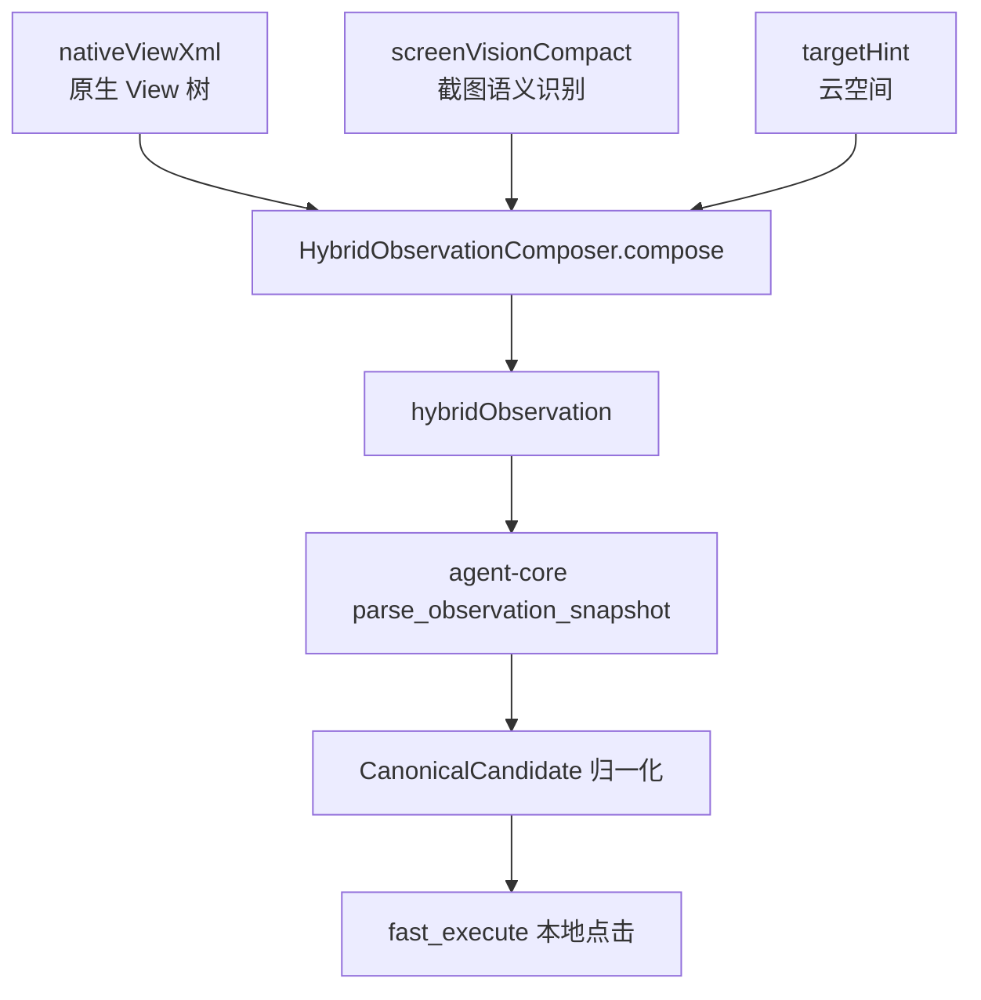

# Me 页面 nativeViewXml / screenVision / hybridObservation 融合示例

本文以 `com.huawei.works.me.fragment.MeMainActivity` 上的“云空间”入口为例，说明 `agent-screen-vision` 的视觉结果如何和原生 `nativeViewXml` 融合，并最终被 `agent-core` 消费为可执行候选。

说明：

- 示例按当前代码字段组织，方便对照 [HybridObservationComposer.java](../../agent-android/src/main/java/com/hh/agent/android/viewcontext/HybridObservationComposer.java) 和 [ViewContextSnapshotProvider.java](../../agent-android/src/main/java/com/hh/agent/android/viewcontext/ViewContextSnapshotProvider.java)。
- 为避免把真实用户头像、姓名、工号等敏感信息落到文档，用户信息做了脱敏。
- 真实设备上的 `nativeViewXml` 可能包含更多装饰性空节点、布局节点和重复容器；本文保留对融合和点击决策有意义的完整字段级样例。
- 坐标以一台 `1080 x 2400` 设备的观测为例，实际机型会有轻微差异。

## 1. 整体链路



融合的核心目标不是“把两份结果并排塞给模型”，而是把它们变成同一套可执行语义：

- `source=fused`：native 节点和 screen vision 信号匹配成功，优先级最高。
- `source=native`：只有原生结构信号，但可点击性、文本、容器关系可靠。
- `source=vision_only`：只有视觉信号，通常作为弱候选或冲突提醒，默认不会压过稳定 native/fused 候选。

## 2. nativeViewXml 输入示例

这是 `MeMainActivity` 中和“云空间”入口相关的一次原生 View 树结果。真实结果由 `InProcessViewHierarchyDumper.dumpHierarchy(...)` 生成，并作为 `nativeViewXml` 放入 `android_view_context_tool` 返回值。

```xml
<?xml version="1.0" encoding="UTF-8"?>
<hierarchy rotation="0" activity="com.huawei.works.me.fragment.MeMainActivity" package="com.huawei.works.uat">
  <node index="0" text="" resource-id="" class="android.widget.FrameLayout" package="com.huawei.works.uat" content-desc="" clickable="false" enabled="true" focusable="false" selected="false" bounds="[0,0][1080,2400]">
    <node index="0" text="" resource-id="android:id/content" class="android.widget.FrameLayout" package="com.huawei.works.uat" content-desc="" clickable="false" enabled="true" focusable="false" selected="false" bounds="[0,72][1080,2400]">
      <node index="0" text="" resource-id="com.huawei.works.uat:id/me_root" class="android.widget.LinearLayout" package="com.huawei.works.uat" content-desc="" clickable="false" enabled="true" focusable="false" selected="false" bounds="[0,72][1080,2400]">
        <node index="0" text="" resource-id="com.huawei.works.uat:id/me_header" class="android.widget.RelativeLayout" package="com.huawei.works.uat" content-desc="" clickable="true" enabled="true" focusable="true" selected="false" bounds="[0,72][1080,438]">
          <node index="0" text="" resource-id="com.huawei.works.uat:id/avatar" class="android.widget.ImageView" package="com.huawei.works.uat" content-desc="头像" clickable="true" enabled="true" focusable="true" selected="false" bounds="[48,142][188,282]" />
          <node index="1" text="高兴" resource-id="com.huawei.works.uat:id/user_name" class="android.widget.TextView" package="com.huawei.works.uat" content-desc="" clickable="false" enabled="true" focusable="false" selected="false" bounds="[220,152][318,197]" />
          <node index="2" text="00612186" resource-id="com.huawei.works.uat:id/user_id" class="android.widget.TextView" package="com.huawei.works.uat" content-desc="" clickable="false" enabled="true" focusable="false" selected="false" bounds="[220,211][374,247]" />
          <node index="3" text="" resource-id="com.huawei.works.uat:id/header_arrow" class="android.widget.ImageView" package="com.huawei.works.uat" content-desc="进入个人信息" clickable="false" enabled="true" focusable="false" selected="false" bounds="[1016,196][1044,224]" />
        </node>

        <node index="1" text="" resource-id="com.huawei.works.uat:id/me_service_grid" class="android.widget.GridLayout" package="com.huawei.works.uat" content-desc="" clickable="false" enabled="true" focusable="false" selected="false" bounds="[24,458][1056,736]">
          <node index="0" text="" resource-id="com.huawei.works.uat:id/service_cloud_space" class="android.widget.LinearLayout" package="com.huawei.works.uat" content-desc="云空间" clickable="true" enabled="true" focusable="true" selected="false" bounds="[72,482][312,698]">
            <node index="0" text="" resource-id="com.huawei.works.uat:id/service_cloud_space_icon" class="android.widget.ImageView" package="com.huawei.works.uat" content-desc="" clickable="false" enabled="true" focusable="false" selected="false" bounds="[160,514][224,578]" />
            <node index="1" text="云空间" resource-id="com.huawei.works.uat:id/service_cloud_space_title" class="android.widget.TextView" package="com.huawei.works.uat" content-desc="" clickable="false" enabled="true" focusable="false" selected="false" bounds="[143,606][241,642]" />
          </node>
          <node index="1" text="" resource-id="com.huawei.works.uat:id/service_cloud_note" class="android.widget.LinearLayout" package="com.huawei.works.uat" content-desc="云笔记" clickable="true" enabled="true" focusable="true" selected="false" bounds="[312,482][552,698]">
            <node index="0" text="" resource-id="com.huawei.works.uat:id/service_cloud_note_icon" class="android.widget.ImageView" package="com.huawei.works.uat" content-desc="" clickable="false" enabled="true" focusable="false" selected="false" bounds="[400,514][464,578]" />
            <node index="1" text="云笔记" resource-id="com.huawei.works.uat:id/service_cloud_note_title" class="android.widget.TextView" package="com.huawei.works.uat" content-desc="" clickable="false" enabled="true" focusable="false" selected="false" bounds="[383,606][481,642]" />
          </node>
          <node index="2" text="" resource-id="com.huawei.works.uat:id/service_card" class="android.widget.LinearLayout" package="com.huawei.works.uat" content-desc="云名片" clickable="true" enabled="true" focusable="true" selected="false" bounds="[552,482][792,698]">
            <node index="0" text="" resource-id="com.huawei.works.uat:id/service_card_icon" class="android.widget.ImageView" package="com.huawei.works.uat" content-desc="" clickable="false" enabled="true" focusable="false" selected="false" bounds="[640,514][704,578]" />
            <node index="1" text="云名片" resource-id="com.huawei.works.uat:id/service_card_title" class="android.widget.TextView" package="com.huawei.works.uat" content-desc="" clickable="false" enabled="true" focusable="false" selected="false" bounds="[623,606][721,642]" />
          </node>
          <node index="3" text="" resource-id="com.huawei.works.uat:id/service_security" class="android.widget.LinearLayout" package="com.huawei.works.uat" content-desc="用户安全中心" clickable="true" enabled="true" focusable="true" selected="false" bounds="[792,482][1032,698]">
            <node index="0" text="" resource-id="com.huawei.works.uat:id/service_security_icon" class="android.widget.ImageView" package="com.huawei.works.uat" content-desc="" clickable="false" enabled="true" focusable="false" selected="false" bounds="[880,514][944,578]" />
            <node index="1" text="用户安全中心" resource-id="com.huawei.works.uat:id/service_security_title" class="android.widget.TextView" package="com.huawei.works.uat" content-desc="" clickable="false" enabled="true" focusable="false" selected="false" bounds="[826,606][998,642]" />
          </node>
        </node>

        <node index="2" text="" resource-id="com.huawei.works.uat:id/me_list" class="android.widget.LinearLayout" package="com.huawei.works.uat" content-desc="" clickable="false" enabled="true" focusable="false" selected="false" bounds="[0,756][1080,2210]">
          <node index="0" text="" resource-id="com.huawei.works.uat:id/item_favorites" class="android.widget.RelativeLayout" package="com.huawei.works.uat" content-desc="收藏" clickable="true" enabled="true" focusable="true" selected="false" bounds="[0,756][1080,868]"><node index="0" text="收藏" resource-id="com.huawei.works.uat:id/title" class="android.widget.TextView" package="com.huawei.works.uat" content-desc="" clickable="false" enabled="true" focusable="false" selected="false" bounds="[96,792][164,832]" /></node>
          <node index="1" text="" resource-id="com.huawei.works.uat:id/item_settings" class="android.widget.RelativeLayout" package="com.huawei.works.uat" content-desc="设置" clickable="true" enabled="true" focusable="true" selected="false" bounds="[0,868][1080,980]"><node index="0" text="设置" resource-id="com.huawei.works.uat:id/title" class="android.widget.TextView" package="com.huawei.works.uat" content-desc="" clickable="false" enabled="true" focusable="false" selected="false" bounds="[96,904][164,944]" /></node>
          <node index="2" text="" resource-id="com.huawei.works.uat:id/item_about" class="android.widget.RelativeLayout" package="com.huawei.works.uat" content-desc="关于" clickable="true" enabled="true" focusable="true" selected="false" bounds="[0,980][1080,1092]"><node index="0" text="关于" resource-id="com.huawei.works.uat:id/title" class="android.widget.TextView" package="com.huawei.works.uat" content-desc="" clickable="false" enabled="true" focusable="false" selected="false" bounds="[96,1016][164,1056]" /></node>
        </node>

        <node index="3" text="" resource-id="com.huawei.works.uat:id/bottom_navigation" class="android.widget.LinearLayout" package="com.huawei.works.uat" content-desc="" clickable="false" enabled="true" focusable="false" selected="false" bounds="[0,2210][1080,2400]">
          <node index="0" text="消息" resource-id="com.huawei.works.uat:id/tab_message" class="android.widget.TextView" package="com.huawei.works.uat" content-desc="" clickable="true" enabled="true" focusable="true" selected="false" bounds="[60,2248][168,2290]" />
          <node index="1" text="通讯录" resource-id="com.huawei.works.uat:id/tab_contacts" class="android.widget.TextView" package="com.huawei.works.uat" content-desc="" clickable="true" enabled="true" focusable="true" selected="false" bounds="[296,2248][428,2290]" />
          <node index="2" text="业务" resource-id="com.huawei.works.uat:id/tab_work" class="android.widget.TextView" package="com.huawei.works.uat" content-desc="" clickable="true" enabled="true" focusable="true" selected="false" bounds="[540,2248][648,2290]" />
          <node index="3" text="我的" resource-id="com.huawei.works.uat:id/tab_me" class="android.widget.TextView" package="com.huawei.works.uat" content-desc="" clickable="true" enabled="true" focusable="true" selected="true" bounds="[884,2248][992,2290]" />
        </node>
      </node>
    </node>
  </node>
</hierarchy>
```

native 结果里的关键点：

- “云空间”有一个可点击父容器：`resource-id=service_cloud_space`，`content-desc=云空间`，`clickable=true`。
- “云空间”也有一个文本子节点：`resource-id=service_cloud_space_title`，`text=云空间`，`clickable=false`。
- 原生树能可靠告诉我们“文本属于哪个父容器”和“父容器是否可点击”，这是纯截图方案很难稳定获得的。

## 3. screenVisionCompact 输入示例

这是 `agent-screen-vision` 对同一帧截图做出的紧凑视觉语义结果。真实结果由宿主侧 `ScreenSnapshotAnalyzer` 返回，并作为 `screenVisionCompact` 进入融合器。

```json
{
  "summary": "Me page with profile header, service shortcut grid, security/settings list, and selected bottom tab. Primary visible targets include 00612186, 云空间, 云笔记, 云名片, 用户安全中心.",
  "page": { "width": 1080, "height": 2400 },
  "texts": [
    { "id": "txt_user_name", "text": "高兴", "bbox": [220, 152, 318, 197], "confidence": 0.99, "importance": 0.74 },
    { "id": "txt_user_id", "text": "00612186", "bbox": [220, 211, 374, 247], "confidence": 0.99, "importance": 0.86 },
    { "id": "txt_cloud_space", "text": "云空间", "bbox": [142, 604, 242, 644], "confidence": 0.99, "importance": 0.96 },
    { "id": "txt_cloud_note", "text": "云笔记", "bbox": [382, 604, 482, 644], "confidence": 0.99, "importance": 0.78 },
    { "id": "txt_cloud_card", "text": "云名片", "bbox": [622, 604, 722, 644], "confidence": 0.98, "importance": 0.72 },
    { "id": "txt_security", "text": "用户安全中心", "bbox": [826, 604, 998, 644], "confidence": 0.98, "importance": 0.70 },
    { "id": "txt_favorites", "text": "收藏", "bbox": [96, 792, 164, 832], "confidence": 0.98, "importance": 0.52 },
    { "id": "txt_settings", "text": "设置", "bbox": [96, 904, 164, 944], "confidence": 0.98, "importance": 0.52 },
    { "id": "txt_about", "text": "关于", "bbox": [96, 1016, 164, 1056], "confidence": 0.97, "importance": 0.44 },
    { "id": "txt_tab_me", "text": "我的", "bbox": [884, 2248, 992, 2290], "confidence": 0.98, "importance": 0.62 }
  ],
  "controls": [
    { "id": "ctl_avatar", "type": "image", "label": "头像", "role": "profile_entry", "bbox": [48, 142, 188, 282], "confidence": 0.93, "importance": 0.66 },
    { "id": "ctl_cloud_space_card", "type": "card", "label": "云空间", "role": "shortcut", "bbox": [72, 482, 312, 698], "confidence": 0.96, "importance": 0.98 },
    { "id": "ctl_cloud_space_icon", "type": "icon", "label": "云空间", "role": "shortcut_icon", "bbox": [160, 514, 224, 578], "confidence": 0.91, "importance": 0.77 },
    { "id": "ctl_cloud_note_card", "type": "card", "label": "云笔记", "role": "shortcut", "bbox": [312, 482, 552, 698], "confidence": 0.95, "importance": 0.73 },
    { "id": "ctl_cloud_card", "type": "card", "label": "云名片", "role": "shortcut", "bbox": [552, 482, 792, 698], "confidence": 0.94, "importance": 0.69 },
    { "id": "ctl_security_card", "type": "card", "label": "用户安全中心", "role": "shortcut", "bbox": [792, 482, 1032, 698], "confidence": 0.94, "importance": 0.67 },
    { "id": "ctl_settings_row", "type": "row", "label": "设置", "role": "list_item", "bbox": [0, 868, 1080, 980], "confidence": 0.92, "importance": 0.49 },
    { "id": "ctl_tab_me", "type": "tab", "label": "我的", "role": "bottom_tab_selected", "bbox": [820, 2210, 1080, 2400], "confidence": 0.94, "importance": 0.58 }
  ],
  "sections": [
    { "id": "sec_profile", "type": "header", "summaryText": "profile: 高兴 00612186", "bbox": [0, 72, 1080, 438], "importance": 0.82, "textCount": 2, "controlCount": 2 },
    { "id": "sec_shortcuts", "type": "grid", "summaryText": "shortcut grid: 云空间, 云笔记, 云名片, 用户安全中心", "bbox": [24, 458, 1056, 736], "importance": 0.96, "textCount": 4, "controlCount": 4 },
    { "id": "sec_settings", "type": "list", "summaryText": "settings list: 收藏, 设置, 关于", "bbox": [0, 756, 1080, 1092], "importance": 0.58, "textCount": 3, "controlCount": 3 }
  ],
  "items": [
    { "id": "item_cloud_space", "type": "grid_item", "sectionId": "sec_shortcuts", "summaryText": "云空间", "bbox": [72, 482, 312, 698], "importance": 0.98, "textCount": 1, "controlCount": 2 },
    { "id": "item_cloud_note", "type": "grid_item", "sectionId": "sec_shortcuts", "summaryText": "云笔记", "bbox": [312, 482, 552, 698], "importance": 0.73, "textCount": 1, "controlCount": 1 },
    { "id": "item_cloud_card", "type": "grid_item", "sectionId": "sec_shortcuts", "summaryText": "云名片", "bbox": [552, 482, 792, 698], "importance": 0.69, "textCount": 1, "controlCount": 1 },
    { "id": "item_security", "type": "grid_item", "sectionId": "sec_shortcuts", "summaryText": "用户安全中心", "bbox": [792, 482, 1032, 698], "importance": 0.67, "textCount": 1, "controlCount": 1 }
  ],
  "debug": { "dropSummary": { "texts": [], "controls": [] } }
}
```

screen vision 的关键价值：

- 能从截图中确认“云空间”确实可见，且位置和 native 文本节点基本重合。
- 能给出区域级语义，例如 `shortcut grid`、`grid_item`、`card`。
- 对原生树缺少语义的 icon/card，可补充视觉上的 `label`、`role` 和 `importance`。

## 4. 融合后的 hybridObservation 示例

下面是 `HybridObservationComposer.compose(...)` 融合后的结果。它会作为 `android_view_context_tool` 的主观察结果进入 `agent-core`。

```json
{
  "schemaVersion": 1,
  "mode": "hybrid_native_screen",
  "primarySource": "native_xml",
  "activityClassName": "com.huawei.works.me.fragment.MeMainActivity",
  "targetHint": "云空间",
  "summary": "Me page with profile header, service shortcut grid, security/settings list, and selected bottom tab. Primary visible targets include 00612186, 云空间, 云笔记, 云名片, 用户安全中心. Native tree captured 31 nodes and fused 18 screenshot matches.",
  "executionHint": "Prefer actionableNodes with source=fused or native and use their bounds as referencedBounds. Treat vision_only nodes as weaker candidates.",
  "page": { "width": 1080, "height": 2400 },
  "availableSignals": { "nativeViewXml": true, "screenVisionCompact": true },
  "quality": {
    "nativeNodeCount": 31,
    "nativeTextNodeCount": 13,
    "visionTextCount": 10,
    "visionControlCount": 8,
    "fusedMatchCount": 18,
    "visionDroppedTextCount": 0,
    "visionDroppedControlCount": 0
  },
  "actionableNodes": [
    {
      "id": "n8",
      "source": "fused",
      "nativeNodeIndex": 8,
      "text": "云空间",
      "className": "android.widget.TextView",
      "resourceId": "com.huawei.works.uat:id/service_cloud_space_title",
      "region": "upper_left",
      "anchorType": "text",
      "containerRole": "grid_item",
      "parentSemanticContext": "云空间 service_cloud_space android.widget.LinearLayout me_service_grid",
      "bounds": { "left": 143, "top": 606, "right": 241, "bottom": 642, "centerX": 192, "centerY": 624 },
      "score": 1.0,
      "actionability": "high",
      "clickable": false,
      "containerClickable": true,
      "enabled": true,
      "selected": false,
      "badgeLike": false,
      "numericLike": false,
      "decorativeLike": false,
      "repeatGroup": true,
      "matchScore": 0.97,
      "matchedVisionId": "txt_cloud_space",
      "matchedVisionKind": "text",
      "visionType": "text",
      "visionLabel": "云空间",
      "visionRole": null
    },
    {
      "id": "n6",
      "source": "fused",
      "nativeNodeIndex": 6,
      "contentDescription": "云空间",
      "className": "android.widget.LinearLayout",
      "resourceId": "com.huawei.works.uat:id/service_cloud_space",
      "region": "upper_left",
      "anchorType": "card",
      "containerRole": "grid_item",
      "parentSemanticContext": "me_service_grid android.widget.GridLayout",
      "bounds": { "left": 72, "top": 482, "right": 312, "bottom": 698, "centerX": 192, "centerY": 590 },
      "score": 0.97,
      "actionability": "high",
      "clickable": true,
      "containerClickable": false,
      "enabled": true,
      "selected": false,
      "badgeLike": false,
      "numericLike": false,
      "decorativeLike": false,
      "repeatGroup": false,
      "matchScore": 0.94,
      "matchedVisionId": "ctl_cloud_space_card",
      "matchedVisionKind": "control",
      "visionType": "card",
      "visionLabel": "云空间",
      "visionRole": "shortcut"
    },
    {
      "id": "n11",
      "source": "fused",
      "nativeNodeIndex": 11,
      "text": "云笔记",
      "className": "android.widget.TextView",
      "resourceId": "com.huawei.works.uat:id/service_cloud_note_title",
      "region": "upper_center",
      "anchorType": "text",
      "containerRole": "grid_item",
      "bounds": { "left": 383, "top": 606, "right": 481, "bottom": 642, "centerX": 432, "centerY": 624 },
      "score": 0.73,
      "actionability": "medium",
      "clickable": false,
      "containerClickable": true,
      "enabled": true,
      "selected": false,
      "repeatGroup": true,
      "matchScore": 0.96,
      "matchedVisionId": "txt_cloud_note",
      "matchedVisionKind": "text",
      "visionType": "text",
      "visionLabel": "云笔记"
    },
    {
      "id": "v2",
      "source": "vision_only",
      "text": "云空间",
      "visionType": "icon",
      "visionRole": "shortcut_icon",
      "region": "upper_left",
      "anchorType": "icon",
      "containerRole": "grid_item",
      "bounds": { "left": 160, "top": 514, "right": 224, "bottom": 578, "centerX": 192, "centerY": 546 },
      "score": 0.83,
      "actionability": "high",
      "clickable": true,
      "containerClickable": false,
      "enabled": true,
      "selected": false,
      "badgeLike": false,
      "numericLike": false,
      "decorativeLike": false,
      "repeatGroup": false
    }
  ],
  "sections": [
    { "id": "sec_profile", "type": "header", "summaryText": "profile: 高兴 00612186", "bbox": [0, 72, 1080, 438], "importance": 0.82, "matchedNativeNodeCount": 4, "textCount": 2, "controlCount": 2 },
    { "id": "sec_shortcuts", "type": "grid", "summaryText": "shortcut grid: 云空间, 云笔记, 云名片, 用户安全中心", "bbox": [24, 458, 1056, 736], "importance": 0.96, "matchedNativeNodeCount": 12, "textCount": 4, "controlCount": 4 },
    { "id": "sec_settings", "type": "list", "summaryText": "settings list: 收藏, 设置, 关于", "bbox": [0, 756, 1080, 1092], "importance": 0.58, "matchedNativeNodeCount": 6, "textCount": 3, "controlCount": 3 }
  ],
  "listItems": [
    { "id": "item_cloud_space", "type": "grid_item", "sectionId": "sec_shortcuts", "summaryText": "云空间", "bbox": [72, 482, 312, 698], "importance": 0.98, "matchedNativeNodeCount": 3, "textCount": 1, "controlCount": 2 },
    { "id": "item_cloud_note", "type": "grid_item", "sectionId": "sec_shortcuts", "summaryText": "云笔记", "bbox": [312, 482, 552, 698], "importance": 0.73, "matchedNativeNodeCount": 3, "textCount": 1, "controlCount": 1 },
    { "id": "item_cloud_card", "type": "grid_item", "sectionId": "sec_shortcuts", "summaryText": "云名片", "bbox": [552, 482, 792, 698], "importance": 0.69, "matchedNativeNodeCount": 3, "textCount": 1, "controlCount": 1 },
    { "id": "item_security", "type": "grid_item", "sectionId": "sec_shortcuts", "summaryText": "用户安全中心", "bbox": [792, 482, 1032, 698], "importance": 0.67, "matchedNativeNodeCount": 3, "textCount": 1, "controlCount": 1 }
  ],
  "conflicts": [
    {
      "code": "vision_only_candidate",
      "severity": "warning",
      "message": "Screen vision found an actionable candidate that has no stable native node match.",
      "visionId": "ctl_cloud_space_icon",
      "visionKind": "control",
      "visionType": "icon",
      "visionLabel": "云空间",
      "bounds": { "left": 160, "top": 514, "right": 224, "bottom": 578, "centerX": 192, "centerY": 546 },
      "nearbyNativeNodeIds": ["n6", "n8"]
    }
  ],
  "debug": {
    "targetHint": "云空间",
    "nativeTopTexts": ["高兴", "00612186", "云空间", "云笔记", "云名片", "用户安全中心", "收藏", "设置", "关于", "我的"],
    "matchedNativeNodeIds": ["n1", "n2", "n6", "n8", "n9", "n11", "n12", "n14", "n15", "n17"],
    "visionOnlySignalIds": ["ctl_cloud_space_icon"]
  }
}
```

融合后可以看到三个重要变化：

- 文本子节点 `n8` 和视觉文本 `txt_cloud_space` 融合成 `source=fused`，分数最高。
- 可点击父容器 `n6` 和视觉卡片 `ctl_cloud_space_card` 也融合成 `source=fused`，可作为点击目标。
- 单独的图标识别 `ctl_cloud_space_icon` 因为没有稳定 native 节点匹配，被标记成 `vision_only_candidate` warning，而不是直接阻断稳定候选。

## 5. agent-core 中的候选归一化结果

`agent-core` 不会直接把每个 `actionableNodes` 都当成独立点击目标，而是会做一层 `CanonicalCandidate` 归一化。

归一化前可能有这些候选：

```json
[
  { "label": "云空间", "source": "fused", "bounds": [143, 606, 241, 642], "clickable": false, "containerClickable": true, "member": "text child" },
  { "label": "云空间", "source": "fused", "bounds": [72, 482, 312, 698], "clickable": true, "containerClickable": false, "member": "parent card" },
  { "label": "云空间", "source": "vision_only", "bounds": [160, 514, 224, 578], "clickable": true, "containerClickable": false, "member": "icon" }
]
```

归一化后会合并为一个可点击概念：

```json
{
  "display_label": "云空间",
  "tap_bounds": { "left": 72, "top": 482, "right": 312, "bottom": 698, "centerX": 192, "centerY": 590 },
  "source_set": ["fused", "vision_only"],
  "source": "fused",
  "actionability_rank": 5,
  "risk_flags": ["repeat_group"],
  "member_count": 3,
  "members": [
    "native text child matched with txt_cloud_space",
    "native clickable parent matched with ctl_cloud_space_card",
    "vision-only icon ctl_cloud_space_icon"
  ]
}
```

这里 `source` 最终被提升为 `fused` 的原因是：

- cluster 内包含稳定 native/fused 成员；
- cluster 内也包含 vision-only icon；
- vision-only 只是补充视觉语义，不应该把整个入口降级成纯视觉候选；
- 因此 fast execute 可以忽略低风险 `vision_only_candidate` warning。

对应日志形态通常是：

```text
[AgentLoop][canonical_candidate_selected] target=云空间 display_label=云空间 source_set=fused,vision_only actionability_rank=5 risk_flags=repeat_group
[AgentLoop][fast_execute_conflict_ignored] code=vision_only_candidate candidate=云空间 candidate_source=fused reason=stable_exact_target_candidate
[AgentLoop][fast_execute_hit] action=tap target=云空间 source=fused score=1
```

## 6. 为什么这种融合比单独使用截图更稳

如果只使用 screen vision：

- 模型能看到“云空间”文字和图标，但不知道哪个父容器是真正可点击的。
- 图标、文字、卡片可能被识别成 2 到 3 个候选，容易出现“候选歧义”。
- 页面上头像、图标、列表入口很多时，纯视觉 warning 会变多。

如果只使用 nativeViewXml：

- 能知道父容器可点击，但部分自绘控件、图片按钮、图标语义可能缺失。
- 当 text 为空但 content-desc 或资源名不稳定时，入口识别会变弱。
- 对视觉布局区域的理解较弱，例如“这是快捷入口卡片区”。

融合后：

- native 提供稳定结构、可点击性、父子关系；
- screen vision 提供文字确认、图标语义、区域语义；
- `hybridObservation` 统一排序和冲突标注；
- `CanonicalCandidate` 把父容器、子文本、图标合并成一个入口；
- fast execute 只在唯一高置信 canonical candidate 时本地执行。

因此在 Me 页这种“头像、icon、快捷卡片很多”的页面里，最终行为会从“多候选回退 LLM”变成“本地稳定命中云空间入口”。

## 7. 请求体中的实际消费形态

在当前优化后的流程里，Me 页导航阶段不需要把上面的所有原始字段都发给 LLM。典型 happy path 是：

1. `Route` 阶段根据用户目标和 skill/execution_hints 得到 `navigation_plan`，例如当前步骤目标为 `云空间`。
2. `Navigate` 阶段调用 `android_view_context_tool`，拿到本地 observation。
3. `agent-core` 在本地解析 `hybridObservation.actionableNodes`。
4. 本地归一化候选后得到唯一 `CanonicalCandidate`。
5. `fast_execute` 直接调用 `android_gesture_tool` 点击，不再追加一轮 LLM。
6. 到达目标页后触发 `goal_reached_context_reset`。
7. `Readout` 阶段只把目标页摘要发给 LLM，且 `tool_count=0`。

这也是当前优化能降低轮次和请求体的原因：融合结果主要服务本地执行，不是把所有视觉原始信息都交给模型逐轮重读。
