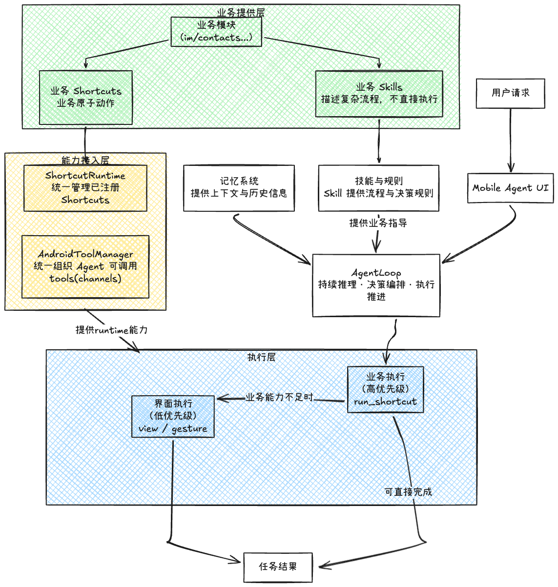
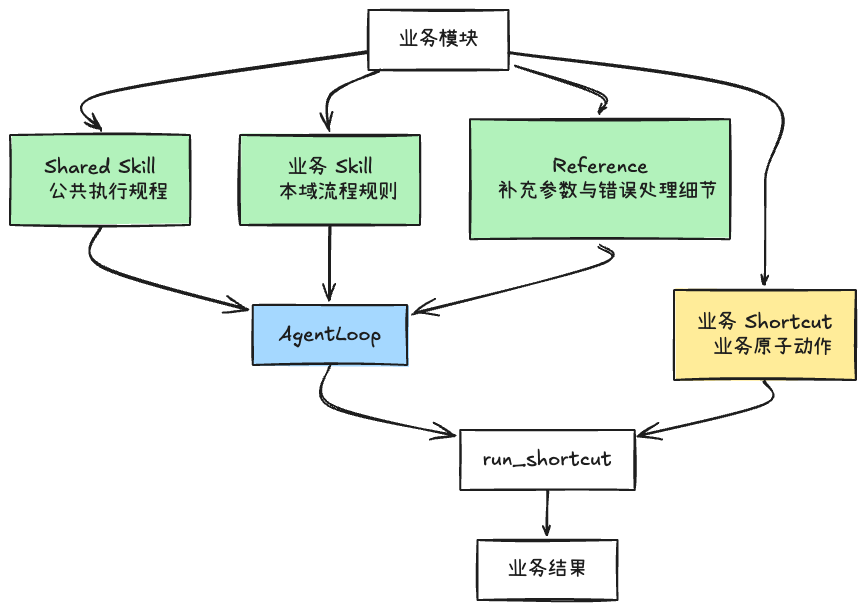
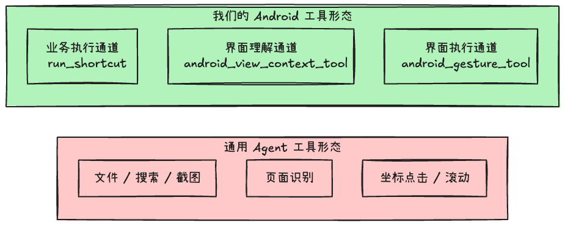
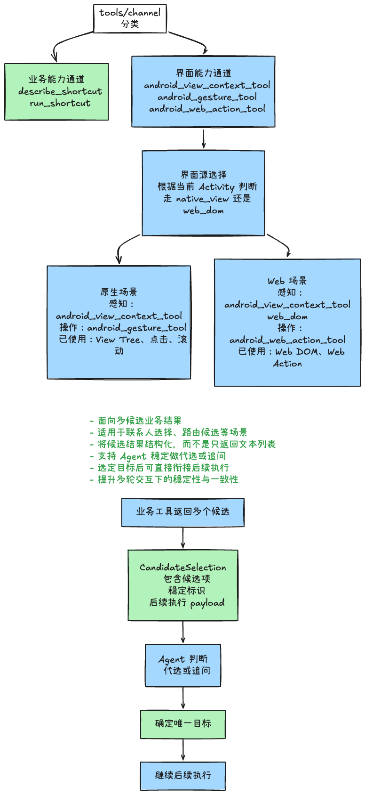
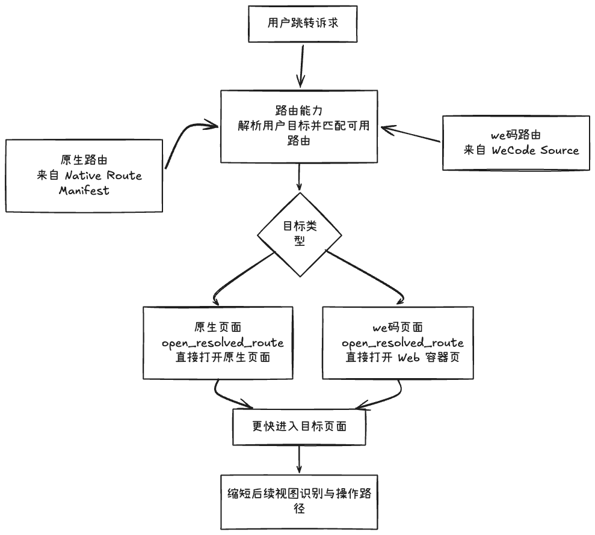
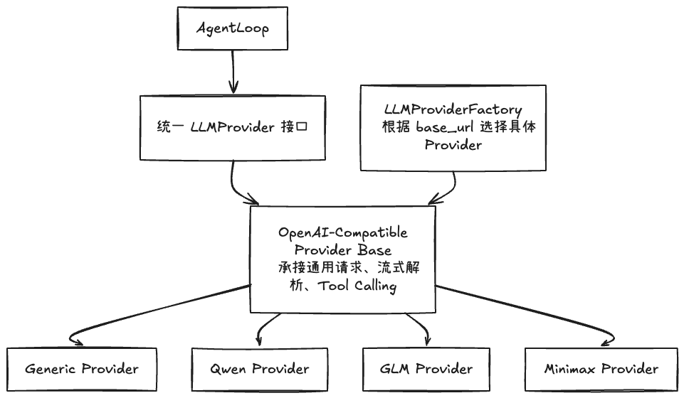
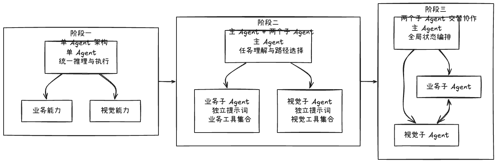

# Mobile Agent 现状和演进路线

---

## 1. 总体架构

整体以 **AgentLoop** 为核心：

* AgentLoop：持续推理 → 决策 → 执行 → 推进

上游输入包括：

* 用户请求
* Memory / Skills（通过业务模块提供）

业务模块结构：

* Shared Skill：负责公共流程
* 业务 Skill：负责本域逻辑
* Reference：补充 shortcut 的参数和细节

最终由 AgentLoop 统一编排，通过 `run_shortcut` 调用真正的业务能力。

---

执行层分为两类：

* 业务执行（优先级高）

    * run_shortcut
    * 可直接完成任务

* 界面执行（作为兜底）

    * view / gesture
    * 当业务能力不可用时执行

---

## 2. 业务特性

### 2.1 业务能力注入

业务能力通过 shortcut 注入：

* AgentLoop 最终统一调度
* 使用 `run_shortcut` 调用真实业务能力

---

### 2.2 tools / channel 分类

分为两类：

#### ① 业务能力通道

* describe_shortcut
* run_shortcut

---

#### ② 界面能力通道

* android_view_context_tool
* android_gesture_tool
* android_web_context_tool
* android_web_action_tool

---

### 2.3 界面类型判断

根据当前 Activity 判断：

* 是 native_view
* 还是 web_dom

---

对应执行方式：

#### Native 场景

* 感知：View Tree
* 操作：点击、滑动（gesture）

---

#### Web 场景

* 感知：Web DOM
* 操作：Web Action

---

## 3. 特殊协议

### 3.1 路由协议

流程：

用户请求
→ 路由能力（解析用户目标并匹配可用路由）
→ 目标类型判断

路由来源：

* Native 路由：来自 Native Route Manifest
* Web 路由：来自 WebCode Source

---

执行结果：

* 原生页面：

    * open_resolved_route
    * 直接打开原生页面

* Web 页面：

    * open_resolved_route
    * 直接打开 Web 容器

---

后续：

* 进入页面
* 继续进入目标页面
* 编排后续路径（识别 → 操作）

---

### 3.2 候选协议（CandidateSelection）

流程：

* 业务工具返回多个候选
* CandidateSelection 包含候选项
* 组装标准 payload
* Agent 判断优选通道
* 确定唯一目标
* 继续后续执行

---

### 3.3 视图观测协议

用于 UI 理解：

#### Native：

* View Tree

#### Web：

* Web DOM

---

用途：

* 提供环境结构
* 支撑后续操作（点击 / 输入 / Action）

---

## 4. 其他

### 多 Provider 方案

说明：

* 统一接口（LLMProvider）
* 公共主干 + 内部适配
* 支持多模型
* 不干扰 Agent 主流程

---

实现方式：

* LLMProviderFactory
* 根据 base_url 选择具体 Provider

---

## 5. Agent架构演进方向

### 阶段一

* 单 Agent
* 任务理解与路径选择

---

### 阶段二

* 两个子 Agent 协作
* 全局状态编排

包含：

* 业务 Agent
* 视觉 Agent

---

两者关系：

* 业务 Agent ↔ 视觉 Agent 交互执行

---

## 6. 业务待实现Feature

业务接入：

1. 丰富原生模块特性，添加业务的skills和shortcuts（优先级：⭐️⭐️⭐️）
2. 思考、设计We码接入方式（除了模拟点击）（⭐️⭐️⭐️）

成功率提升：

1. 原生View和WebDom的输入格式归一（可行性待评估）（⭐️⭐️）
2. OCR辅助视觉识别（可行性待评估）（⭐️⭐️）

可靠性提升：

1. 补全单元测试（⭐️⭐️）
2. 设计Agent效果的评估系统（用例库），用于测评每个版本的优化效果（⭐️⭐️⭐️）
3. token用量评估，抑制系统提示词膨胀（⭐️⭐️）

用户体验：

1. 文字输出效果优化（⭐️）
2. 思考、正文输出内容和语气优化（屏蔽内部tools、skills展示）（⭐️）

其他：

1. 安全和权限管理（⭐️）
